Data Cleaning
================
Author:- Sai Krishna,Chad Crowe,Rhonda Silva

## Introduction

Heartland Family Service, which was founded in Omaha in 1875, served
more than 79,000 individuals and families last year through direct
services, education, and outreach from more than 15 facilities in east
central Nebraska and southwest Iowa. In the following focus areas, our
programs provide important human services to children, individuals, and
families:

• Housing, Safety, and Financial Stability

• Child & Family Well-Being

• Counseling & Prevention

Staff can hand-craft an integrated, multi-service, trauma-informed
strategy to help clients toward safety, well-being, and, ultimately,
self-sufficiency, thanks to their programs and services. A sliding
pricing scale is available for some of their counseling services.

Heartland Family Service’s objective is to enhance communities by
providing education, counseling, and support services to individuals and
families. Last year, Heartland Family Service, which was founded in
Omaha in 1875, served 60,309 individuals and families through direct
services, education, and outreach from more than 15 locations in east
central Nebraska and southwest Iowa. In the following target areas:
Child & Family Well-Being, Counseling & Prevention, and Housing, Safety,
& Financial Stability,their programs provide important human services to
the individuals and families that ultimately create the future of our
community.

# Cleaning Process

### Rearch Questions Over View:

#### RQ 1

**My Research Question is to show the time it takes to cmpletely enroll for services.(i.e. Entering into system and Approving
the enrollment).** **(Sai Krishna)**

Reason:- This will help in analyzing the time taking per enrolling from
starting to ending state. And what kind of people are enrolling on the
day of the service or before the service and total time taken for individual
service. This will help the HFS to improve the speed of enrollment and
also can increste the type service in that location.

### Data cleaning:

I have created a new data set based on attributes that I chose from
Dataset to analyze my desired Research Question. Attributes are
mentioned bellow.

`facility`, `actual_date`, `event_name`, `date_entered`,
`approved_date`, `program_unit_description`, `zip`,
`state`,`ethnic_identity`

#### In the new data set there 3 variables that talks about the dates in numeric form.

`actual_date` is about the actual data of the program admission.

`date_entered` is about when was the service entered (days after
enrollment or days before enrollment)

`approved_date` is about when was the service documentation approved by
a supervisor? (Days after enrollment)

#### Other Attributes:

`event_name` is about the name of the event.

`program_unit_description` is about the event description

`zip` Zip of the location

`state` Which location is the

`ethnic_identity` this is about the people of different groups who
attend the events

### Cleaning procedure :-

**step 1:-** Since I am using Data format, I need to find the
difference between each and every service that has taken place. So, i
have used as.Date() function to get the actual date format.

**step 2:-** Apply step1 to all the date column to verify it in next
phase.

**step 3:-** Now create a new column add subtract the dates if we get
the values as negatives then enrollment is before the service,if 0 then
they resisted at the moment and if greater thsn 0 then it is after the
service.

**step 4:-** Later total we have 5 states in the data set which is
mentioned in short form

**step 5:-** Subset each and every State are in short form like
`IA`,`NE`,`CO`,`NC`,`SC`and later updated to full form of user
understanding `Iowa`, `Nebraska` Colorado`,"North Carolina","South Carolina"
and we can observe many different plots based on state and there zip
code.

``` r
HFS_data<-read.csv("HFS Service Data.csv")
#before cleasing the Na values
#head(HFS_data)
```

Libraries used

``` r
library('ggplot2')
```

As the Information for the sources of the data that is fatched out to
csv on **25th August 2021**.

By using this date i have created original data of the events. with the
help of **as.Date()** function in R

``` r
HFS_data$AD<-as.Date(-(HFS_data$actual_date), origin = '2021-08-25')
HFS_data$ED<-as.Date(-(HFS_data$date_entered), origin = '2021-08-25')
HFS_data$Date_of_approved_date<-as.Date(-(HFS_data$approved_date), origin = '2021-08-25')

HFS_data$AD_1<-(HFS_data$actual_date-HFS_data$date_entered)
#str(HFS_data)
```

### Cleaning State Names:

We have a total of five states

``` r
regions<-c(unique(HFS_data$state))
regions
```

    ## [1] "IA" "NE" "CO" "NC" "SC"

Now we update all the states name into full form and then into the
dataset for easy understanding.

``` r
HFS_data$state<- as.character(HFS_data$state)
HFS_data$state[HFS_data$state == "NE"] <- "nebrska"
HFS_data$state[HFS_data$state == "IA"] <- "iowa"
HFS_data$state[HFS_data$state == "SC"] <- "south carolina"
HFS_data$state[HFS_data$state == "NC"] <- "north carolina"
HFS_data$state[HFS_data$state == "CO"] <- "colorado"
```

After Changing the Short form of the state:-

``` r
c(unique(HFS_data$state))
```

    ## [1] "iowa"           "nebraska"        "colorado"       "north carolina"
    ## [5] "south carolina"

# Splitting the individual data accoring to the region:-

# IA(iowa):

``` r
IA<- subset(HFS_data,state=='iowa')
#str(IA)
p <- ggplot(data = IA, aes(y =IA$AD, x =IA$AD_1,color=ethnic_identity ))
p + geom_point()+geom_violin() +facet_wrap(IA$zip~IA$program_name,scales='free')
```

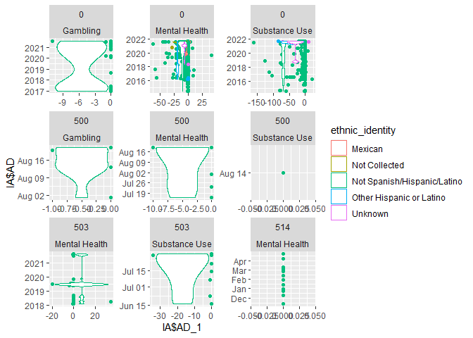<!-- --> In
the above graph you can understand that most of the people from Iowa
that receive services are **Not Spanish/Hispanic/Latino** most of them are
opting Gambling services where as other ethnic_identity groups are receiving services like **Mental Health** and **Substance Use** and most of them are
from Zip code 0. ### NE(nebraska)

``` r
NE<- subset(HFS_data,state=='nebrska')
#head(NE)
p <- ggplot(data = NE, aes(y =NE$AD, x =NE$AD_1,color=ethnic_identity ))
p + geom_point() +geom_violin()+facet_wrap(zip~program_name,scales='free')
```

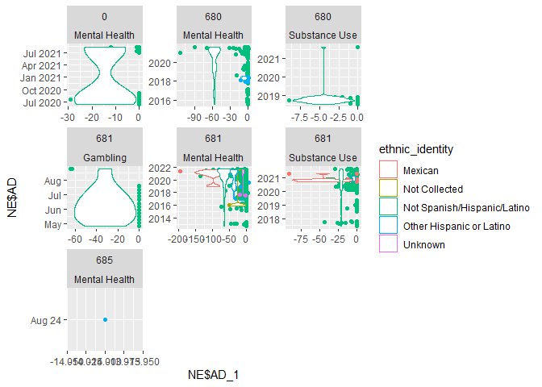<!-- --> In
this graph we can under stand how the date ### CO(colorado)

``` r
CO<- subset(HFS_data,state=='colorado')
#head(CO)
p <- ggplot(data = CO, aes(y =CO$AD, x =CO$AD_1,color=ethnic_identity ))
p + geom_point() +geom_violin()+facet_wrap(~zip,scales='free')
```

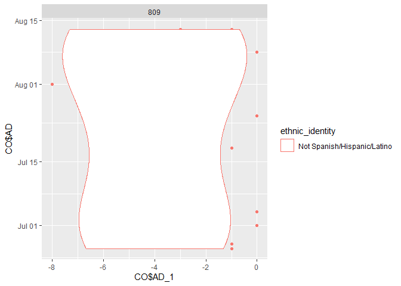<!-- -->

### NC(north carolina)

``` r
NC<- subset(HFS_data,state=='north carolina')
#head(NC)
p <- ggplot(data = NC, aes(y =NC$AD, x =NC$AD_1,color=ethnic_identity ))
p + geom_point() +geom_violin()+facet_wrap(~zip,scales='free')
```

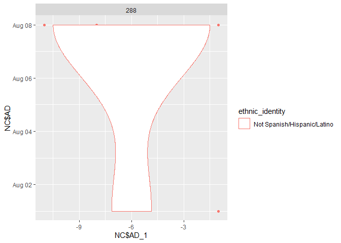<!-- -->

### SC(south carolina)

``` r
SC<- subset(HFS_data,state=='south carolina')
#head(SC)
p <- ggplot(data = SC, aes(y =SC$AD, x =SC$AD_1,color=ethnic_identity ))
p + geom_point() +geom_violin()+facet_wrap(~zip,scales='free')
```

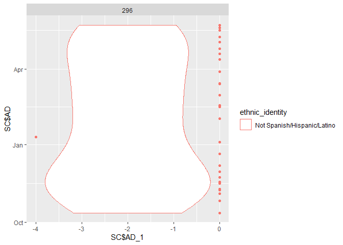<!-- -->

## RQ 2

### Job Position, Ethnicity, Location, and Dropped Appointments (Chad Crowe)

### RQ Overview

The third research question concerns exploring the job role of
therapists within HFS, with specific interest in appointment no shows.
When patients fail to appear for appointments, this costs HFS time and
costs the patient opportunity for therapy. We explore whether there
exist clear patterns that might contribute to patients missing visits,
such as a location or ethnicity effect. It might be the case that
particular facilities are less friendly in supporting a language, which
might effect the rate of dropped appointments.

The research also explores whether job title effects dropped
appointments. Job requirements might change from title to title that
might have an effect on dropped appointments. This research explores the
phenomenon.

Initial research also explores appointment duration. Based on the given
data, it is unknown whether appointment duration is fixed by insurance
or varies between patients. This research explores duration of
appointments across job position, ethnicity, location, and the rate of
dropped appointments too. While success is not determined by duration,
Dr. Juarez mentioned how HFS is very interested in exploring patterns
pertaining to the number of appointments and durations by each patient
since it affects the funding HFS receives.

### Datasets Used

The data explored in this research question include five columns:

-   Job Title (Therapists I, II, and III)

-   Ethnicity

-   Facility Location

-   Appointment Duration

-   Appointment No Shows

Each column will be explored in the following section. The section will
describe the number of rows & columns and provide sample headers. The
section will also include a description of the metadata, such as what
information is available for understanding and interpreting the data.
The section will also cover the rationale for remediating and cleaning
the data, such as handling empty data. It will also include a
description of the approach and the code required for replication.

### Description of Datasets

#### Job Title (Therapists I, II, and III)

``` r
library('dplyr')
```

    ## 
    ## Attaching package: 'dplyr'

    ## The following objects are masked from 'package:stats':
    ## 
    ##     filter, lag

    ## The following objects are masked from 'package:base':
    ## 
    ##     intersect, setdiff, setequal, union

``` r
library('tidyverse')
```

    ## -- Attaching packages --------------------------------------- tidyverse 1.3.1 --

    ## v tibble  3.1.5     v purrr   0.3.4
    ## v tidyr   1.1.4     v stringr 1.4.0
    ## v readr   2.0.2     v forcats 0.5.1

    ## -- Conflicts ------------------------------------------ tidyverse_conflicts() --
    ## x dplyr::filter() masks stats::filter()
    ## x dplyr::lag()    masks stats::lag()

``` r
library('moderndive')
#data <- read.csv("/Users/ccrowe/github/isqa8600_ChadCrowe/programs/data/HFS Service Data.csv")
data <- read.csv("HFS Service Data.csv")
```

The data contains 8745 rows. If we filter out NA values for job title
there are 8745. This means each row has a job title and there are no NA
values. Given that there is no missing data, there is no need to handle
missing data.

Below is a plot of available job titles:

``` r
tibble_data <- as_tibble(data)
# data header
head(tibble_data$job_title)
```

    ## [1] "Clinical Supervisor" "THERAPIST II"        "THERAPIST II"       
    ## [4] "THERAPIST II"        "THERAPIST II"        "THERAPIST II"

``` r
job_title_counts <- tibble_data %>% group_by(job_title) %>% count(sort=TRUE)
ggplot(job_title_counts) + geom_point(mapping = aes(x = reorder(job_title,-n), y = n)) +
ggtitle("Count of Rows for each Job Title") +
xlab("Job Title") +
ylab("Count of Job Title's Occurrence") +
 #ylim(0, 130) + 
  theme(axis.text.x = element_text(angle = 90, vjust = 0.5, hjust=1), legend.position = "none")
```

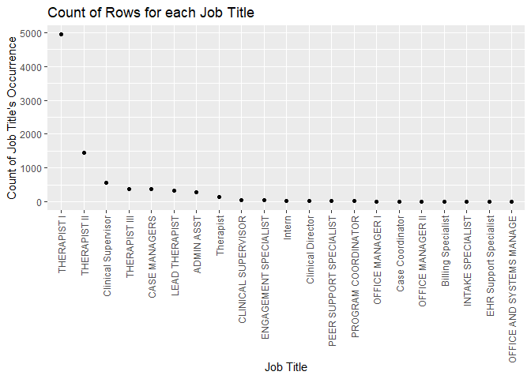<!-- -->

Most job titles have fewer than fifty instances. Job titles with many
instances include therapist, clinical supervisor, case managers, and
admin assists. Of those job titles, there are five types of therapists.
Given most of the primary job titles are therapists, the exploration of
job titles will focus on therapists. We filter the job titles to the
various therapist job positions.

``` r
therapists = data %>% filter(data$job_title == "THERAPIST I" | data$job_title == "THERAPIST II" | data$job_title == "THERAPIST III" | data$job_title == "LEAD THERAPIST" | data$job_title == "Therapist")
```

If we filter out therapists there are only 7246 rows, so 1500 fewer
rows.

#### Ethnicity

``` r
tibble_data <- as_tibble(data)
ethnicity <- tibble_data %>% group_by(ethnic_identity) %>% count(sort=TRUE)
# data header
head(tibble_data$ethnic_identity)
```

    ## [1] "Not Spanish/Hispanic/Latino" "Not Spanish/Hispanic/Latino"
    ## [3] "Not Spanish/Hispanic/Latino" "Not Spanish/Hispanic/Latino"
    ## [5] "Not Spanish/Hispanic/Latino" "Not Spanish/Hispanic/Latino"

There are no NAs for the ethnic_identity column. The ethnic identities
are categorized as Mexian, Hispanic/Latino, and not
Spanish/Hispanic/Latino. Ninety-percent of the data (7820 rows) are not
Spanish, Hispanic or Latino. The following plot shows the diparity of
counts within the ethic_identity column.

``` r
ggplot(ethnicity) + geom_point(mapping = aes(x = reorder(ethnic_identity,-n), y = n)) +
ggtitle("Count of Rows for each Ethnicity") +
xlab("Ethnicity") +
ylab("Count of Job Title's Occurrence") +
  theme(axis.text.x = element_text(angle = 90, vjust = 0.5, hjust=1), legend.position = "none")
```

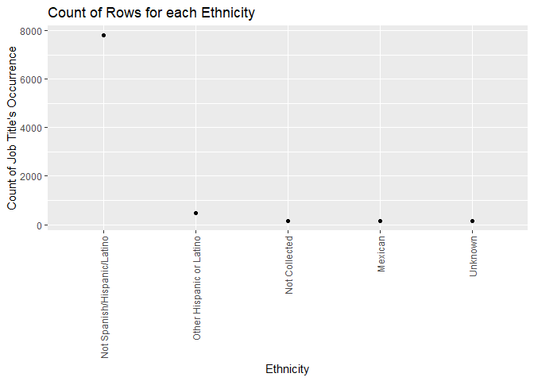<!-- -->

Given that most categories have fewer than two-hundred persons, one
simlification is to create a binary column for Not
Spanish/Hispanic/Latino and Spanish/Hispanic/Lantino. We’ll filter out
unknown since it contains no ethnic identity information. Otherwise,
there are no NAs or missing data in this column so there’s no need to
handle or filter out NAs.

``` r
two_ethnicities <- tibble_data %>% mutate(is_minority = ethnic_identity != "Not Spanish/Hispanic/Latino") %>% filter(ethnic_identity != "Unknown")
two_ethnicities %>% group_by(is_minority) %>% count()
```

    ## # A tibble: 2 x 2
    ## # Groups:   is_minority [2]
    ##   is_minority     n
    ##   <lgl>       <int>
    ## 1 FALSE        7820
    ## 2 TRUE          784

When we filter by the identified ethinicities and filter out the unknown
category we get almost 800 rows of ethnicities HFS tracks.

#### Facility Location

Below we can see a breakdown of records per facility. We group by
facility and sort by the facilities with the most usage. This will help
us understand the usage of HFS facilities within the dataset.

``` r
tibble_data <- as_tibble(data)
# data header
head(tibble_data$facility)
```

    ## [1] "Heartland Family Service - Logan" "Center Mall Office"              
    ## [3] "Center Mall Office"               "Center Mall Office"              
    ## [5] "Center Mall Office"               "Center Mall Office"

``` r
grouped_facility <- tibble_data %>% group_by(facility) %>% count(sort=TRUE)
#ordered <- transform(grouped_facility, variable=reorder(facility, n) ) 
ggplot(grouped_facility) + geom_point(mapping = aes(x = reorder(facility,-n), y = n)) +
ggtitle("Count of Rows for each Ethnicity") +
xlab("Ethnicity") +
ylab("Count of Job Title's Occurrence") +
  theme(axis.text.x = element_text(angle = 90, vjust = 0.5, hjust=1), legend.position = "none")
```

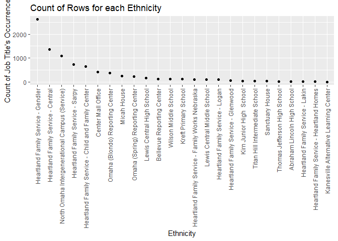<!-- -->

``` r
# check for NAs
tibble_data %>% filter(facility == NA) %>% count()
```

    ## # A tibble: 1 x 1
    ##       n
    ##   <int>
    ## 1     0

From the graph we see nine main facilities with more than two-hundred
records. There are three facilities with more than one-thousand rows. We
want to avoid aggregating smaller facilities together since each
facility might be very different. For now, we will leave the smaller
facilities in the data. Later on, we might remove facilities with very
few users. No rows are NA so there is no need to handle NAs or missing
data in this column.

#### Appointment No Shows

The column is_noshow is interesting because these are costly events for
both HFS and for the potential benefactor. No_shows consume HFS
appointment time and the person loses out on an opportunity for therapy.

``` r
tibble_data <- as_tibble(data)
# data header
head(tibble_data$is_noshow)
```

    ## [1] FALSE FALSE FALSE  TRUE FALSE FALSE

``` r
grouped_no_show <- tibble_data %>% group_by(is_noshow) %>% count(sort=TRUE)
ggplot(grouped_no_show) + geom_point(mapping = aes(x = reorder(is_noshow,-n), y = n)) +
ggtitle("Count of Rows for Show vs NoShow") +
xlab("Appointment Show or No Show") +
ylab("Count of Category") +
  theme(axis.text.x = element_text(angle = 90, vjust = 0.5, hjust=1), legend.position = "none")
```

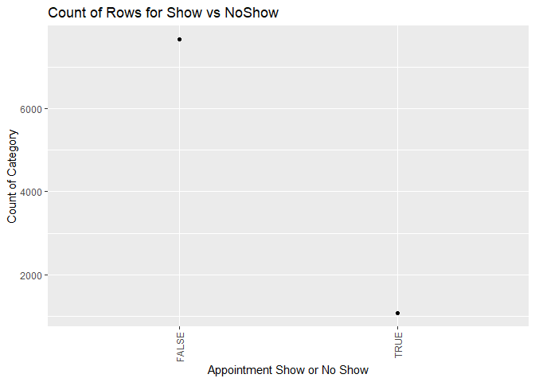<!-- -->

``` r
# check for NAs
tibble_data %>% filter(is_noshow == NA) %>% count()
```

    ## # A tibble: 1 x 1
    ##       n
    ##   <int>
    ## 1     0

We see that 15% of all rows are no shows. 15% seems like a surprisingly
high number of appointment no shows for any organization. This metric is
worth looking into further. There are no NAs in the column or values we
want to filter.

### Number of Appointments per Person

HFS has voiced an interest in the number of appointments and total
duration spent per patient. While duration length or the number of
appointments does not connotate to organizational success, they are
metrics that HFS reports to funders.

``` r
tibble_data <- as_tibble(data)
# data header
head(tibble_data$recordID)
```

    ## [1] 298 338 338 338 338 338

``` r
record_counts <- tibble_data %>% group_by(recordID) %>% count(sort=TRUE) %>% filter(n > 2)
ggplot(record_counts) + geom_point(mapping = aes(x = reorder(recordID,-n), y = n)) +
ggtitle("Count of Rows for Show vs NoShow") +
xlab("Appointment Show or No Show") +
ylab("Count of Category") +
  theme(axis.text.x = element_text(angle = 90, vjust = 0.5, hjust=1), legend.position = "none")
```

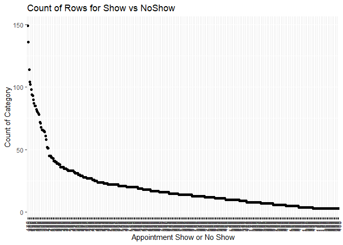<!-- -->

There are only 460 records with more than one appointment with HFS,
which is only 5% of all HFS records. From this we learn that almost all
appointments are single-time appointments. Considering the few number of
records with multiple appointments, it might not be worth looking
further into the factors affecting duration or the number of
appointments.

#### RQ 3

### RQ Rhonda

Of the clients receiving services that identified as Hispanic or
Mexican, how many received services at which branch

### Dataset Used

``` r
library(ggplot2)
HFS.Hispanic<-read.csv("HFS Service Data.csv")
str(HFS.Hispanic)
```

    ## 'data.frame':    8745 obs. of  51 variables:
    ##  $ gender                  : chr  "Male" "Female" "Female" "Female" ...
    ##  $ program_name            : chr  "Mental Health" "Mental Health" "Mental Health" "Mental Health" ...
    ##  $ program_type            : chr  "Counseling and Prevention" "Counseling and Prevention" "Counseling and Prevention" "Counseling and Prevention" ...
    ##  $ facility                : chr  "Heartland Family Service - Logan" "Center Mall Office" "Center Mall Office" "Center Mall Office" ...
    ##  $ job_title               : chr  "Clinical Supervisor" "THERAPIST II" "THERAPIST II" "THERAPIST II" ...
    ##  $ staff_name              : chr  "Poore, Lindsay" "Carlson, Kaitlin" "Carlson, Kaitlin" "Carlson, Kaitlin" ...
    ##  $ actual_date             : int  961 857 682 710 696 772 794 864 661 737 ...
    ##  $ duration                : chr  "0:00" "0:02" "0:51" "0:00" ...
    ##  $ event_name              : chr  "Daily Living Assessment DLA 20" "Collateral Note" "Individual Therapy" "Individual Therapy" ...
    ##  $ activity_type           : chr  "" "Phone" "" "" ...
    ##  $ encounter_with          : chr  "" "Client" "" "" ...
    ##  $ is_client_involved      : logi  TRUE TRUE TRUE TRUE TRUE TRUE ...
    ##  $ is_noshow               : logi  FALSE FALSE FALSE TRUE FALSE FALSE ...
    ##  $ is_locked               : logi  FALSE TRUE TRUE TRUE TRUE TRUE ...
    ##  $ is_billed               : logi  FALSE FALSE TRUE FALSE TRUE FALSE ...
    ##  $ is_paid                 : logi  FALSE FALSE FALSE FALSE FALSE FALSE ...
    ##  $ date_entered            : int  961 857 683 710 696 773 795 864 661 739 ...
    ##  $ user_entered_name       : chr  "Poore, Lindsay" "Carlson, Kaitlin V." "Carlson, Kaitlin V." "Carlson, Kaitlin V." ...
    ##  $ approved_date           : int  NA 857 689 714 697 773 795 864 662 739 ...
    ##  $ approved_staff_name     : chr  "" "Carlson, Kaitlin V." "Stanek, Sean" "Stanek, Sean" ...
    ##  $ submitted               : chr  "" "Approved" "Approved" "Approved" ...
    ##  $ is_approved             : int  0 1 1 1 1 1 1 1 1 1 ...
    ##  $ is_notapproved          : int  0 0 0 0 0 0 0 0 0 0 ...
    ##  $ is_notapproved_subm     : int  1 0 0 0 0 0 0 0 0 0 ...
    ##  $ program_unit_description: chr  "Behavioral Health IA -  Mental Health" "Behavioral Health NE - Mental Health" "Behavioral Health NE - Mental Health" "Behavioral Health NE - Mental Health" ...
    ##  $ sc_code                 : chr  "1311-16" "1311-05" "1311-05" "1311-05" ...
    ##  $ duration_num            : int  0 2 51 0 50 80 4 2 52 115 ...
    ##  $ do_not_bill             : logi  FALSE FALSE FALSE FALSE FALSE FALSE ...
    ##  $ do_not_pay              : logi  FALSE FALSE FALSE FALSE FALSE FALSE ...
    ##  $ general_location        : chr  "" "Homeless Shelter" "Home" "Telehealth - Phone" ...
    ##  $ program_modifier        : chr  "No Modifier - IA" "Heartland Housing Navigation" "Heartland Housing Navigation" "Heartland Housing Navigation" ...
    ##  $ program_modifier_code   : chr  "NMODI" "HHN" "HHN" "HHN" ...
    ##  $ NormalWorkHours         : chr  "Yes" "Yes" "Yes" "Yes" ...
    ##  $ duration_other_num      : int  0 0 10 0 10 10 0 0 10 10 ...
    ##  $ duration_other          : chr  "0:00" "0:00" "0:10" "0:00" ...
    ##  $ travel_time_num         : int  0 0 0 0 0 0 0 0 0 0 ...
    ##  $ travel_time             : chr  "0:00" "0:00" "0:00" "0:00" ...
    ##  $ planning_time_num       : int  0 0 0 0 0 0 0 0 0 0 ...
    ##  $ planning_time           : chr  "0:00" "0:00" "0:00" "0:00" ...
    ##  $ total_duration_num      : int  0 2 61 0 60 90 4 2 62 125 ...
    ##  $ total_duration          : chr  "0:00" "0:02" "1:01" "0:00" ...
    ##  $ reason_for_no_show      : chr  "" "" "" "Client No Show - No Call" ...
    ##  $ is_billable             : logi  FALSE FALSE FALSE FALSE FALSE FALSE ...
    ##  $ zip                     : int  0 681 681 681 681 681 681 681 681 681 ...
    ##  $ state                   : chr  "IA" "NE" "NE" "NE" ...
    ##  $ age                     : int  12 26 25 25 25 25 25 26 25 25 ...
    ##  $ recordID                : int  298 338 338 338 338 338 338 338 338 338 ...
    ##  $ simple_race             : int  8 16 16 16 16 16 16 16 16 16 ...
    ##  $ ethnic_identity         : chr  "Not Spanish/Hispanic/Latino" "Not Spanish/Hispanic/Latino" "Not Spanish/Hispanic/Latino" "Not Spanish/Hispanic/Latino" ...
    ##  $ gender_identity         : chr  "Not Obtained" NA NA NA ...
    ##  $ sexual_orientation      : chr  "Not Obtained" NA NA NA ...

### To see the names of Columns

``` r
names(HFS.Hispanic)  
```

    ##  [1] "gender"                   "program_name"            
    ##  [3] "program_type"             "facility"                
    ##  [5] "job_title"                "staff_name"              
    ##  [7] "actual_date"              "duration"                
    ##  [9] "event_name"               "activity_type"           
    ## [11] "encounter_with"           "is_client_involved"      
    ## [13] "is_noshow"                "is_locked"               
    ## [15] "is_billed"                "is_paid"                 
    ## [17] "date_entered"             "user_entered_name"       
    ## [19] "approved_date"            "approved_staff_name"     
    ## [21] "submitted"                "is_approved"             
    ## [23] "is_notapproved"           "is_notapproved_subm"     
    ## [25] "program_unit_description" "sc_code"                 
    ## [27] "duration_num"             "do_not_bill"             
    ## [29] "do_not_pay"               "general_location"        
    ## [31] "program_modifier"         "program_modifier_code"   
    ## [33] "NormalWorkHours"          "duration_other_num"      
    ## [35] "duration_other"           "travel_time_num"         
    ## [37] "travel_time"              "planning_time_num"       
    ## [39] "planning_time"            "total_duration_num"      
    ## [41] "total_duration"           "reason_for_no_show"      
    ## [43] "is_billable"              "zip"                     
    ## [45] "state"                    "age"                     
    ## [47] "recordID"                 "simple_race"             
    ## [49] "ethnic_identity"          "gender_identity"         
    ## [51] "sexual_orientation"

``` r
### Deleted Columns that I didn't need and named it HFS.Hispanic.cleaned
```

``` r
HFS.Hispanic.cleaned<-HFS.Hispanic[c(1:4,7,9,17,25,30,46,48,49:51)]
```

``` r
names(HFS.Hispanic.cleaned)
```

    ##  [1] "gender"                   "program_name"            
    ##  [3] "program_type"             "facility"                
    ##  [5] "actual_date"              "event_name"              
    ##  [7] "date_entered"             "program_unit_description"
    ##  [9] "general_location"         "age"                     
    ## [11] "simple_race"              "ethnic_identity"         
    ## [13] "gender_identity"          "sexual_orientation"

\*\* I now have 14 columns & 8745 rows

``` r
ncol(HFS.Hispanic.cleaned);nrow(HFS.Hispanic.cleaned)
```

    ## [1] 14

    ## [1] 8745

1.  **One scatter plot with three variables, properly labeled; choose
    your representation of the third variable based on what’s best for
    representing the data.**  

-   Three used variables are:
    -   ethnic_identity
    -   program_unit_description  
    -   Adding a third variable in geom point using colour=program_name

``` r
ggplot(data = HFS.Hispanic.cleaned, aes(x =ethnic_identity , y =program_unit_description , colour=program_name)) +geom_point(size = 3)+
     labs(title = "Scatter plot with three variables", y = "Unit Description of the Program", x = "Ethnicity")
```


The above scatter plot is composed of three variables: ethnic_identity,
program_unit description and program_name. from this plot , we can say
that people have mostly participated in the mental health program. The
second major program is for the substance use program. The plot also
describes that NON HISPANIC clients are most likely to be treated in the
programs.

2.  **One faceted plot of two variables, properly labeled.**  

-   Two used variables are:
    -   ethnic_identity
    -   facility

``` r
ggplot(data = HFS.Hispanic.cleaned, aes(facility,ethnic_identity)) +
 geom_line(color = "steelblue", size = 1) +
  geom_point(color = "steelblue") +
   labs(title = "Faceted plot of two variables Ethnic Identity vs Facility", y = "facility", x = "ethnic_identity") +
    facet_wrap(.~program_type)
```

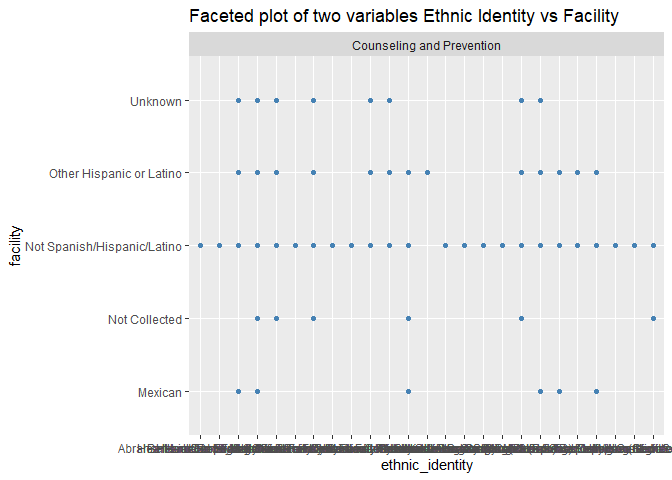

# Thing explored:

We have explored many different types of attributes that are required to
solve the 3 research questions and we analysed the data that we
have now can also get other results.Further We can subset each and every
Character data and get additional information.

# Results

All the Data is perfectly cleaned and analysed. We can get clear and
beautiful plots or results from the cleaned data.
