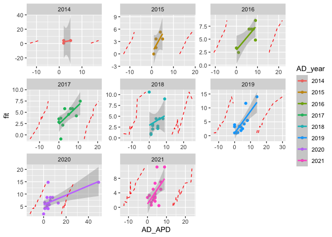
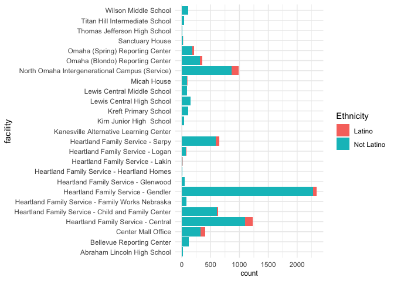
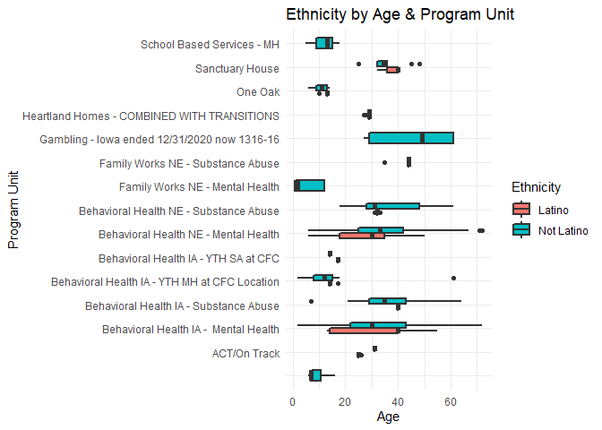

<center>
<h1>
HFS-Documentation
</h1>
</center>
<center>
<h3>
<u>table of contents</u>
</h3>
</center>

-   [Research Question](#research-questions)

-   [Data Cleaning](#data-cleaning)

-   [R Script](#r-script)

-   [R plots](#r-plots)

-   [Results](#results)

-   [Conclusion](#conclusion)

-   [Reference](#reference)

## Team Members:

-   Sai Krishna Gaduputi Subbammagari

-   Chad Crowe

-   Rhonda Silva

# Licence

[GNU General Public License
v3.0](https://github.com/saikrishnags05/Project-for-Data-to-Decisions/blob/master/LICENSE)

# Introduction

Heartland Family Service, which was founded in Omaha in 1875, served
more than 79,000 individuals and families last year through direct
services, education, and outreach from more than 15 facilities in east
central Nebraska and southwest Iowa. In the following focus areas, our
programs provide important human services to children, individuals, and
families:

• Housing, Safety, and Financial Stability

• Child & Family Well-Being

• Counseling & Prevention

Staff can hand-craft an integrated, multi-service, trauma-informed
strategy to help clients toward safety, well-being, and, ultimately,
self-sufficiency, thanks to their programs and services. A sliding
pricing scale is available for some of their counseling services.

Heartland Family Service’s objective is to enhance communities by
providing education, counseling, and support services to individuals and
families. Last year, Heartland Family Service, which was founded in
Omaha in 1875, served 60,309 individuals and families through direct
services, education, and outreach from more than 15 locations in east
central Nebraska and southwest Iowa. In the following target areas:
Child & Family Well-Being, Counseling & Prevention, and Housing, Safety,
& Financial Stability,their programs provide important human services to
the individuals and families that ultimately create the future of our
community.

# Research Questions

**1)Do significant delays exist between enrolling in an event, entering
into the system, and the enrollment approval?**

**Reason:**

It will help the HFS to know the average time taken for a person to
complete the full process for any event that is organized in different
facility till date. So that If they find any delay in enrolling then
they can take action on the particular location and improve the
approving process .

**2)Do HFS facility locations have a significant effect on the number of
missed appointments?**

**Reason:**

There might be unknown but significant reasons why particular locations
have higher rates of missing appointments, such as issues with facility
accessibility or local financial burdens like access to transportation.

The second research question concerns exploring the job role of
therapists within HFS, with specific interest in appointment no shows.
When patients fail to appear for appointments, this costs HFS time and
costs the patient opportunity for therapy. We explore whether there
exist clear patterns that might contribute to patients missing visits,
such as a location or ethnicity effect. It might be the case that
particular facilities are less friendly in supporting a language, which
might effect the rate of dropped appointments.

The research also explores whether job title effects dropped
appointments. Job requirements might change from title to title that
might have an effect on dropped appointments. This research explores the
phenomenon.

Initial research also explores appointment duration. Based on the given
data, it is unknown whether appointment duration is fixed by insurance
or varies between patients. This research explores duration of
appointments across job position, ethnicity, location, and the rate of
dropped appointments too. While success is not determined by duration,
Dr. Juarez mentioned how HFS is very interested in exploring patterns
pertaining to the number of appointments and durations by each patient
since it affects the funding HFS receives.

**3)Which facilities provide services to clients identifying as
Latino?**

**Reason:**

Which facilities provide services to Latino ethnicity? Would the Clients
prefer to have communication in Spanish? Do these facilities provide
Spanish-speaking therapists?

# Data Cleaning

We have created a new dataset based which can help use to achive a bvest
results for our Research Question. Attributes are mentioned bellow.

`facility`, `actual_date`, `event_name`, `date_entered`,
`approved_date`, `program_unit_description`, `zip`,
`state`,`ethnic_identity`,
`Job Title (Therapists I, II, and III)`,`Appointment Duration`.
`Appointment No Shows`.

**step 1:-** collect all the columns that are required and store them in
a data frame **HFS_data**

**step 2:-** Since we are using Data format so we have to find the
original date. So, we have used as.Date() function to get the actual
date format.

**step 3:-** Apply step2 to all the date column to verify it in next
phase.

**step 4:-** Now create a new column . Now apply add and subtract
methods on the dates if we get the values in negatives then it is
enrolled before the event,if 0 then they resisted at the moment and if
greater the 0 then it is after the event.

**step 5:-** Total we have 5 states in the data set which is mentioned
in short form

**step 6:-** Every State in short form like `IA`,`NE`,`CO`,`NC`,`SC`and
later updated to full form of user understanding `iowa`,
`Nebrska`,`colorado`, `north carolina`,`south carolina` and we can
observe many different plots based on state and there zip code.

**step 7:-** The data contains rows. If we filter out NA values for job
title there are 8158. This means each row has a job title and there are
no NA values. Given that there is no missing data, there is no need to
handle missing data.

**step 8:-**

Most job titles have fewer than fifty instances. Job titles with many
instances include therapist, clinical supervisor, case managers, and
admin assists. Of those job titles, there are five types of therapists.
Given most of the primary job titles are therapists, the exploration of
job titles will focus on therapists. We filter the job titles to the
various therapist job positions.

If we filter out therapists there are only 7246 rows, so 1500 fewer
rows.

-   **Ethnicity**

We see that 15% of all rows are no shows. 15% seems like a surprisingly
high number of appointment no shows for any organization. This metric is
worth looking into further. There are no NAs in the column or values we
want to filter.

**Step 9** Delete Rows that have “Not Collected” in variable
Ethnic_Identity.

**Step 10** I then discovered that the variable “ethnic_identity” had
the following classes *Mexican *Not Collected *Not
Spanish/Hispanic/Latino *Other Hispanic or Latino \*Unknown

I omitted the rows that had “Not collected” or “Unknown” since this
information will not help with the interpretation of data.

I then changed “Mexican” to “Latino” and “Other Hispanic or Latino” to
“Latino” I changed “Not Spanish/Hispanic/Latino” to “Not Latino” This
leaves the data with 2 classes for the variable titled “ethnic_identity”
Latino Not Latino

# R Script

## Research Question 1

###Iowa

In the below code i have filtered the original data with the state name
and aggregate the whole data based to get an average time taken for
completing the HFS process.

In the Below code i have build a model to see if it have better
confidence in between the attributes in the data frame or not

tried to get a predict value for over all data for Iowa

Now i have created a plot to see how the predicted value is similar with

``` r
# 2. Regression line + confidence intervals
library("ggplot2")
p <- ggplot(mydata, aes(y=fit,x=AD_APD,color=AD_year ))+ geom_point()+geom_smooth(method = "lm")+facet_wrap(~AD_year,scales = 'free')

# 3. Add prediction intervals
p + geom_line(aes(x = lwr), color = "red", linetype = "dashed")+
  geom_line(aes(x = upr), color = "red", linetype = "dashed")
```

    ## `geom_smooth()` using formula 'y ~ x'

<!-- -->

(optional) Now for just verification i am trying to get a Residuals of
the data that is present in Iowa

    ##             Df Sum Sq Mean Sq F value  Pr(>F)   
    ## facility    19  321.2  16.905   2.304 0.00932 **
    ## Residuals   51  374.3   7.339                   
    ## ---
    ## Signif. codes:  0 '***' 0.001 '**' 0.01 '*' 0.05 '.' 0.1 ' ' 1

###Nebrska

    ## `geom_smooth()` using formula 'y ~ x'

<!-- -->


## Research Question 3:

### Bar chart of Ethnicity & Facility

This BarChart shows us that the majority of Latinos served attend the
North Omaha Campus and the Heartland Family Service-Central location.

``` r
ggplot(HFS.Ethnicity2) +
  aes(x = facility, fill = ethnic_identity)+
  labs(fill = "Ethnicity")+
  geom_bar() +
  scale_fill_hue(direction = 1) +
  coord_flip() +
  theme_minimal() +
  theme(axis.title.x = element_text(size = 9L))
```

<!-- -->

This BoxPlot identifies that most Latinos receive services for Mental
Health Programs and are between the ages of 18 and 50.

``` r
ggplot(HFS.Ethnicity2) +
  aes(x = program_unit_description, y = age, fill = ethnic_identity) +
  geom_boxplot(width=0.5, lwd=1) +
  scale_color_hue(direction = 1) +
  ylab("Age") + xlab("Program Unit")+
  labs(fill = "Ethnicity") +
  labs (title = "Ethnicity by Age & Program Unit") +
  coord_flip() +
  theme_minimal()
```

<!-- -->

# R plots

# Research Question 1

If we observe the Graph we can tell that over all behavior of enrollment
process w.r.t the time taken for per person to enroll for an event from
past **8 years** in the state of **Iowa**.

-   There are few facilities where it is taking more time to enroll for
    a person compared to the previous year.

-   We can notice that in the enrolling time is so fast in schools.

-   From the plot, I can tell that all the enrollments are been late for
    the past 2 years there may be multiple reasons.

**Example: -** lockdown because Covid-19 which stopped the process

``` r
HFS_data$state[HFS_data$state == "IA"] <- "iowa"
IA<-subset(HFS_data,HFS_data$state=="iowa")#,HFS_data$program_name=='Mental Health')
ag_ia<-aggregate(IA$AD_APD~IA$facility+IA$AD_year,IA,mean)
ag_ia$`IA$AD_APD`<-round(ag_ia$`IA$AD_APD`,0)
names(ag_ia)[names(ag_ia) == "IA$facility"] <- "facility"     
names(ag_ia)[names(ag_ia) == "IA$AD_year"] <-"AD_year"      
names(ag_ia)[names(ag_ia) == "IA$program_name"] <-"program_name" 
names(ag_ia)[names(ag_ia) == "IA$AD_APD"] <-"AD_APD"
#library('plotly')
p <- ggplot(data=ag_ia, aes(x=AD_APD,y=facility,fill=AD_year)) +
  geom_bar(stat="identity", position=position_dodge())+labs(title = "Average Time taken for a person to enroll for a program") +xlab('Average days for a person to register')+ylab('Facility in Iowa')+ labs(colour = "Years")+ scale_fill_brewer(palette="Blues")
#ggplotly(p)
p
```

<!-- -->

``` r
HFS_data$state[HFS_data$state == "NE"] <- "nebrska"
NE<-subset(HFS_data,HFS_data$state=="nebrska")#,HFS_data$program_name=='Mental Health')

ag_ne<-aggregate(NE$AD_APD~NE$facility+NE$AD_year+NE$program_name,NE,mean)

ag_ne$`NE$AD_APD`<-round(ag_ne$`NE$AD_APD`,0)
names(ag_ne)[names(ag_ne) == "NE$facility"] <- "facility"     
names(ag_ne)[names(ag_ne) == "NE$AD_year"] <-"AD_year"      
names(ag_ne)[names(ag_ne) == "NE$program_name"] <-"program_name" 
names(ag_ne)[names(ag_ne) == "NE$AD_APD"] <-"AD_APD"
p <- ggplot(data=ag_ne, aes(x=AD_APD,y=facility,fill=AD_year)) +
  geom_bar(stat="identity", position=position_dodge())+labs(title = "Average Time taken for a person to enroll for a program") +xlab('Average days for a person to register')+ylab('Facility in Nebraska')+ labs(colour = "Years")+ scale_fill_brewer(palette="Blues")
p
```

<!-- -->

If we observe the Graph we can tell that over all behavior of enrollment
process w.r.t the time taken for per person to enroll for an event from
past **9 years** in the state of **Nebraska**. \* We found out that
overall enrollment time is decresed compared to previous years.

-   In some facilities the enrollement process is same.

-   Some did not conduct any event for next few years.

-   Overall there is no delay in the registration process compared to
    previous years.

# Research Question 2

HFS facility locations have a significant effect on the number of missed
appointments.

The research question builds on existing knowledge that Omaha and Iowa
contain pockets of segregated populations, both in terms of ethnicity,
finances, and priviledge. The research question poses that location
might have a significant effect on missed appointments. If a particular
location has a population with financial access to vehicles, or even
multiple vehicles, they might be more able to make their appointments.
Initially, we hope to identify that facility location affects missed
appointments. If we can show this is true, we can further explore what
about the facility location negatively affects client’s ability to make
their appointments. This research data specifically looks at the mental
health program, the largest for HFS. This research also breaks down no
shows by the type of therapist, knowing that different types of
therapists might handle different appointments, each of which might be
related to the likelihood of missing appointments. This research
quesiton does not break down the data by ethnicity, only because the
ethnicity counts were not large enough to be meaningful for each
facility and job title.

``` r
library('tidyverse') 
```

    ## -- Attaching packages --------------------------------------- tidyverse 1.3.1 --

    ## v ggplot2 3.3.5     v purrr   0.3.4
    ## v tibble  3.1.4     v dplyr   1.0.7
    ## v tidyr   1.1.3     v stringr 1.4.0
    ## v readr   2.0.1     v forcats 0.5.1

    ## -- Conflicts ------------------------------------------ tidyverse_conflicts() --
    ## x dplyr::filter() masks stats::filter()
    ## x dplyr::lag()    masks stats::lag()

``` r
library('ggplot2') # for sample plot if required
library('dplyr') # to use pipelines '%>%' for data set
```

``` r
HFS_data<-read.csv("HFS Service Data.csv") # read data set
```

``` r
data <- HFS_data
therapists = data %>% filter(data$job_title == "THERAPIST I" | data$job_title == "THERAPIST II" | data$job_title == "THERAPIST III" | data$job_title == "LEAD THERAPIST" | data$job_title == "Therapist")
```

#### Plot: No show percentage by facility, ethnicity, and type of therapist

``` r
# possibly look at no show rate by facility
mental_health <- therapists %>% filter(program_name == "Mental Health")
noshow_stats <- mental_health %>% group_by(facility, job_title) %>% count(is_noshow) %>% filter(n > 20)
noshows <- noshow_stats %>% filter(is_noshow == "FALSE")
shows <- noshow_stats %>% filter(is_noshow == "TRUE")
noshow_stats_consolidated <- inner_join(shows,noshows,by=c("facility","job_title"), suffix = c("no", "yes"))
#noshow_stats_consolidated <- select(noshow_stats_consolidated, -c(is_noshowno, is_noshowyes))
noshow_percent <- noshow_stats_consolidated %>% add_column(noshow_percent = .$nno / (.$nyes + .$nno) * 100)
df <- noshow_percent

ggplot(data = df) + geom_point(mapping = aes(x = reorder(job_title,noshow_percent), y = noshow_percent))  + facet_wrap(~ reorder(facility, -noshow_percent)) +
ggtitle("No Shows is a Location Problem\n(No Show Percentage by Job Title Across Facilities)") +
xlab("Job Title") +
ylab("Percentage of Clients Who Miss Appointments") +
 theme(axis.text.x = element_text(angle = 90, vjust = 0.5, hjust=1), legend.position = "none") 
```

<!-- -->

The purpose of the above graph is to highlight the stark different in
the y-axis for each facet. The y-axis shows no show percentage, which
captures the percentage of appointments that are missed, e.g., clients
do not show up for their appointments. The facet is facility, such as
the “Center Mall Office” and “Omaha (Blondo) Reporting Center.” The
graph shows significant differences in no show percentage by facility.
The range itself varies from around 5% to almost 30%, depending on the
facility. The plot also separates out job function since it has a
significant effect on no show percentage and tends to drop from
Therapist I to Therapist II.

The takeaway is that no show percentage is tightly related to the
facility. This means that the rate at which clients skip or miss
appointments is tightly coupled with the specific facility. This means
that some facilities show much higher rates of appointment misses than
others. For example, the Gendler HFS location should expect very high
appointment no shows, up to 25% contrasted with the Sarpy location that
averages fewer than 10% no shows.

HFS should seek to understand why location is closely coupled to missing
appointments. This might be related to particular locations being more
difficult to access, such as difficult traffic or limited parking. On
the other hand, each location might have very different populations,
whether via ethnicity or financial differences that provide different
levels of privilege, which in turn affect client’s ability to allocate
time for appointments. Further research should seek to understand what
about location or the clients that visit these locations affect missed
appointments.

# Research Question 3

The data cleaning results in a new subset of 5 variables based on the
attributes analyzed in the first research question. Important columns
within this data cleaning are listed below: program_unit_desc
ethnic_identity age facility program_type

This BoxPlot identifies that most Latinos receive services for Mental
Health Programs and are between the ages of 18 and 50.

``` r
ggplot(HFS.Ethnicity2) +
  aes(x = program_unit_description, y = age, fill = ethnic_identity) +
  geom_boxplot(width=0.5, lwd=1) +
  scale_color_hue(direction = 1) +
  ylab("Age") + xlab("Program Unit")+
  labs(fill = "Ethnicity") +
  labs (title = "Ethnicity by Age & Program Unit") +
  coord_flip() +
  theme_minimal()
```

<!-- -->

##Bar chart of Ethnicity & Facility

This BarChart shows us that the majority of Latinos served attend the
North Omaha Campus and the Heartland Family Service-Central location.

``` r
p<-ggplot(HFS.Ethnicity2) +
  aes(x = facility, fill = ethnic_identity) +
  geom_bar() +
  scale_fill_hue(direction = 1) +
  coord_flip() +
  theme_minimal() +  theme(axis.title.x = element_text(size = 9L),)
p
```

<!-- -->

# Results

# Conclusion

RQ1: Different facilities have significantly different delays. Schools
are especially fast but counties are slower.

RQ2: Missed appointments are closely related to the facility. Slight
differences in missed appointments by the type of therapist (I vs II).

RQ3: HFS could possibly benefit by having the bilingual staff at the
Sarpy Office as well so that there are 3 branches throughout the metro
area to serve Latino client

# Reference

-   <https://www.heartlandfamilyservice.org/>

-   <https://addictiontreatmentmagazine.com/rehab/heartland-family-service-omaha/>

-   <https://www.heartlandfamilyservice.org/our-mission/>
