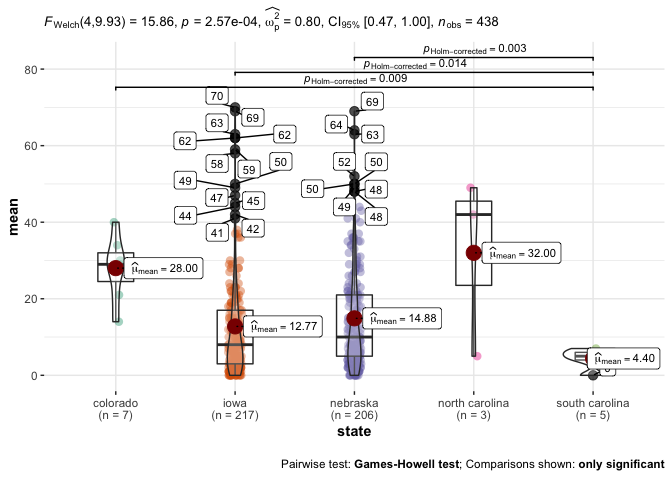

## Contributor Statement

Chad, Sai and Rhonda each contributed to the project plan. Sai worked on
Research Question 1 Chad worked on Research Question 2 Rhonda worked on
Research Question 3 Chad proofread

The entire group is performing data exploration concerning location and
its relationship to other columns, such as the onboarding duration,
ethnicity, program name, and job title. Given this general direction of
interest, each of us explored a related research question. Fortunately,
based on the data exploration documentation, we are updating the
direction of our research. Specifically, how does onboarding duration
change when enhanced by interesting findings concerning ethnicity,
program name, and job title. Part of the progress demonstrated by this
assignment intertwines these aspects.

## Introduction

Heartland Family Service, which was founded in Omaha in 1875, served
more than 79,000 individuals and families last year through direct
services, education, and outreach from more than 15 facilities in east
central Nebraska and southwest Iowa. In the following focus areas, our
programs provide important human services to children, individuals, and
families:

• Housing, Safety, and Financial Stability

• Child & Family Well-Being

• Counseling & Prevention

Heartland Family Service’s objective is to enhance communities by
providing education, counseling, and support services to individuals and
families. Last year, Heartland Family Service, which was founded in
Omaha in 1875, served 60,309 individuals and families through direct
services, education, and outreach from more than 15 locations in east
central Nebraska and southwest Iowa. In the following target areas:
Child & Family Well-Being, Counseling & Prevention, and Housing, Safety,
& Financial Stability,their programs provide important human services to
the individuals and families that ultimately create the future of our
community.

# R Script

## RQ 1

The first reserach question explores datetime relationships per person.
Specifically, we look at the time delay between signup and the first
appointment, as well as appointment volumes by datetime for HFS.

### Reason

This will help in analyzing the time taken per enrolling; from the
signup to the appointment date. It will also give us insights concerning
demographic breakdowns per customer, e.g., their ethnic identity and
location. We will also explore the total time taken for each event. This
analysis will provide HFS data concerning their enrollment speed by
different customer facets.

### Data cleaning:

The data cleaning results in a new subset of data based on the
attributes analyzed in the first research question. Important columns
within this data cleaning are listed below:

`facility`, `actual_date`, `event_name`, `date_entered`,
`approved_date`, `program_unit_description`, `zip`,
`state`,`ethnic_identity`

    library('tidyverse') 

    ## ── Attaching packages ─────────────────────────────────────── tidyverse 1.3.1 ──

    ## ✓ ggplot2 3.3.5     ✓ purrr   0.3.4
    ## ✓ tibble  3.1.4     ✓ dplyr   1.0.7
    ## ✓ tidyr   1.1.3     ✓ stringr 1.4.0
    ## ✓ readr   2.0.1     ✓ forcats 0.5.1

    ## ── Conflicts ────────────────────────────────────────── tidyverse_conflicts() ──
    ## x dplyr::filter() masks stats::filter()
    ## x dplyr::lag()    masks stats::lag()

    library('ggplot2') # for sample plot if required
    library('dplyr') # to use pipelines '%>%' for data set

    HFS_data<-read.csv("HFS Service Data.csv") # read data set

    selected_columns<-c("program_name","facility","actual_date","event_name","date_entered",   
     "approved_date","zip","state","age","ethnic_identity")
    # Above list is used for selecting the columns in the dataset 

    HFS_data<-HFS_data %>%
      select(selected_columns)  # this command is used for selecting the required columns

    ## Note: Using an external vector in selections is ambiguous.
    ## ℹ Use `all_of(selected_columns)` instead of `selected_columns` to silence this message.
    ## ℹ See <https://tidyselect.r-lib.org/reference/faq-external-vector.html>.
    ## This message is displayed once per session.

    HFS_data<-HFS_data %>% drop_na() # we use this to delete NA values

    HFS_data<-HFS_data[!(HFS_data$ethnic_identity=="Not Collected" | HFS_data$ethnic_identity=="Unknown"),] # delete unwanted rows from a single column

    HFS_data$facility <- sub("Heartland Family Service", "HFS", HFS_data$facility)
    HFS_data$facility <- sub("North Omaha Intergenerational Campus (Service)", "NOICS", HFS_data$facility)
    # using Regex to compress the name of Facility

    #sapply(HFS_data, function(x) sum(is.na(x)))

The latest date we fetch from the CSV is **25th August 2021**.

We use the function as.Date in R to generate the date of events in R.

    HFS_data$AD<-as.Date(-(HFS_data$actual_date), origin = '2021-08-25')
    HFS_data$ED<-as.Date(-(HFS_data$date_entered), origin = '2021-08-25')
    HFS_data$Date_of_approved_date<-as.Date(-(HFS_data$approved_date), origin = '2021-08-25')
    HFS_data$AD_1<-(HFS_data$actual_date-HFS_data$date_entered)
    #str(HFS_data)

#### Numeric Data Columns

`actual_date` is about the actual data of the program admission.

`date_entered` is when the appointment occurred (days after enrollment
or days before enrollment)

`approved_date` is when the appointment is approved by a supervisor?
(Days after enrollment)

#### Other Columns:

`event_name` is the name of the event.

`program_unit_description`is the event description

`zip` The zip code of the location

`state` The state for the appointment

`ethnic_identity` Describes the affiliated ethnic identity for the
person.

### Cleaning procidure

**step 1:-** Since I am using Data format I have to find the difference
between each and every even that has taken place. I have used as.Date()
function to get the actual date format.

**step 2:-** Apply step1 to all the date columns to verify it in next
phase.

**step 3:-** Now we create a new column and subtract the dates. Negative
values imply an enrollment before the event. Zero implies day-of
enrollment.

**step 4:-** We have 5 states in the data set which are shown via
abbreviations.

**step 5:-** Subset each and every State are in short form like
`IA`,`NE`,`CO`,`NC`,`SC`and later updated to full form of user
understanding `Iowa`, `Nebrska` `Colorado`,
`North Carolina`,`South Carolina`. We will also plot against the state
and zip code.

The latest date we fetch from the CSV is **25th August 2021**.

We use the function as.Date in R to generate the date of events in R.

### Cleaning State Names:

We then look at the time data by state.

Now we update all the states names in the dataset, which helps with
overall readability.

    # clean NA values.
    HFS_data$AD<-as.Date(-(HFS_data$actual_date), origin = '2021-08-25')
    HFS_data$ED<-as.Date(-(HFS_data$date_entered), origin = '2021-08-25')
    HFS_data$AD_M_Y <- format(as.Date(HFS_data$AD), "%Y-%m")
    HFS_data$AD_year<-(format(as.Date(HFS_data$ED), "%Y"))

The above code with create two different columns for `YEAR`, `Month`,
and `Year`

    HFS_data$AD_ED<-(HFS_data$actual_date-HFS_data$date_entered)
    HFS_data$ED_APD<-(HFS_data$date_entered-HFS_data$approved_date)
    HFS_data$AD_APD<-(abs(HFS_data$actual_date-HFS_data$approved_date))

    HFS_data$state[HFS_data$state == "NE"] <- "nebraska"
    HFS_data$state[HFS_data$state == "IA"] <- "iowa"
    HFS_data$state[HFS_data$state == "SC"] <- "south carolina"
    HFS_data$state[HFS_data$state == "NC"] <- "north carolina"
    HFS_data$state[HFS_data$state == "CO"] <- "colorado"

In the below code I created a data set via the function `group by`. This
fetches all the information concerning the enrollment process.

    library(dplyr)
    #FUN = quantile,probs = c(0.05, 0.95)
    aggregate_wrt_year<-(aggregate(AD_APD~AD_M_Y+program_name+event_name+state+facility,HFS_data,FUN = quantile,probs = c(0.05, 0.95)))
    group_hfs<-group_by(HFS_data,AD_APD, program_name,facility,AD_year,state) %>%
      summarise(
        count = n(),
        mean = mean(AD_APD, na.rm = TRUE),
      )

    ## `summarise()` has grouped output by 'AD_APD', 'program_name', 'facility', 'AD_year'. You can override using the `.groups` argument.

    names(group_hfs)[names(group_hfs)=='HFS_data$program_name'] <-'program_name'
    names(group_hfs)[names(group_hfs)=='HFS_data$facility'] <-'facility'

We can look at the normality of the dates of enrollment

    shapiro.test(group_hfs$AD_APD)

    ## 
    ##  Shapiro-Wilk normality test
    ## 
    ## data:  group_hfs$AD_APD
    ## W = 0.6828, p-value < 2.2e-16

We then use ANOVA to get the relationship between many of the variables.
This might not be valid since the distribution is not normal.

    options(ggrepel.max.overlaps = Inf)
    aov_group_hfs <- aov(cbind(AD_APD)~program_name+state+facility+AD_year+mean, data = group_hfs)
    summary_group_hfs<-summary(aov_group_hfs)
    summary_group_hfs

    ##                Df Sum Sq Mean Sq   F value Pr(>F)    
    ## program_name    2   1778     889 1.363e+32 <2e-16 ***
    ## state           4   7894    1973 3.025e+32 <2e-16 ***
    ## facility       24  32580    1358 2.081e+32 <2e-16 ***
    ## AD_year         9  10260    1140 1.748e+32 <2e-16 ***
    ## mean            1 377068  377068 5.780e+34 <2e-16 ***
    ## Residuals    1491      0       0                     
    ## ---
    ## Signif. codes:  0 '***' 0.001 '**' 0.01 '*' 0.05 '.' 0.1 ' ' 1

According to the Summary Statistics we can tell that mean of
State,facility and years are similar to one another.

We can then remove the outliers in the data set which contains data of
2021:

    library(ggstatsplot)

    ## You can cite this package as:
    ##      Patil, I. (2021). Visualizations with statistical details: The 'ggstatsplot' approach.
    ##      Journal of Open Source Software, 6(61), 3167, doi:10.21105/joss.03167

    #Create a boxplot that labels the outliers  
    df2021<-filter(aov_group_hfs$model,aov_group_hfs$model$AD_year==2021)
    # In df2021 i filter the data based on year 2020 to get in depth idea about the average time taken for registeration process.

and then plot the outliers.

    ggbetweenstats(df2021,state,mean,outlier.tagging = TRUE)

And here are some sample statistics, such as the quartiles and even
outliers.

    Q <- quantile(df2021$mean, probs=c(.05, .95))
    iqr <- IQR(df2021$mean)
    up <-  Q[2]+1.5*iqr # Upper Range  
    low<- Q[1]-1.5*iqr # Lower Range
    eliminated<- subset(df2021, df2021$mean > (Q[1] - 1.5*iqr) & df2021$mean < (Q[2]+1.5*iqr))
    head(eliminated,6)

    ##   AD_APD  program_name    state                  facility AD_year mean
    ## 1      0      Gambling     iowa             HFS - Gendler    2021    0
    ## 2      0      Gambling nebraska             HFS - Gendler    2021    0
    ## 3      0 Mental Health nebraska Bellevue Reporting Center    2021    0
    ## 4      0 Mental Health     iowa        Center Mall Office    2021    0
    ## 5      0 Mental Health nebraska        Center Mall Office    2021    0
    ## 6      0 Mental Health nebraska             HFS - Central    2021    0

Below is the plot once we remove the outliers.

    ggbetweenstats(eliminated, state, mean, outlier.tagging = TRUE)

After verifying the initial boxplot we found out that the year data
includes 2020 and 2021.

    library(ggstatsplot)
    #Create a boxplot that labels the outliers  
    df2020<-filter(aov_group_hfs$model,aov_group_hfs$model$AD_year==2020)
    # In df2020 i filter the data based on year 2020 to get in depth idea about the average time taken for registeration process.

    ggbetweenstats(df2020,state,mean,outlier.tagging = TRUE) # final plot for outliers 

We remove the top and bottom 5% of the data.

    Q <- quantile(df2020$mean, probs=c(.05, .95), na.rm = FALSE)
    iqr <- IQR(df2020$mean)
    up <-  Q[2]+1.5*iqr # Upper Range  
    low<- Q[1]-1.5*iqr # Lower Range
    eliminated<- subset(df2020, df2020$mean > (Q[1] - 1.5*iqr) & df2020$mean < (Q[2]+1.5*iqr))
    ggbetweenstats(eliminated, state, mean, outlier.tagging = TRUE)

We now do some data modeling using caret for machine learning.

    library('caret')

    ## Loading required package: lattice

    ## 
    ## Attaching package: 'caret'

    ## The following object is masked from 'package:purrr':
    ## 
    ##     lift

    # define training control
    train_control <- trainControl(method="boot", number=10)
    # train the model
    sub_set<-data.frame(aov_group_hfs$model$program_name,aov_group_hfs$mode$AD_year,aov_group_hfs$model$mean)
    model <- train(aov_group_hfs.model.program_name~.,sub_set, trControl=train_control, method="nb")

    ## Warning: model fit failed for Resample01: usekernel=FALSE, fL=0, adjust=1 Error in NaiveBayes.default(x, y, usekernel = FALSE, fL = param$fL, ...) : 
    ##   Zero variances for at least one class in variables: aov_group_hfs.mode.AD_year2013, aov_group_hfs.mode.AD_year2014, aov_group_hfs.mode.AD_year2015, aov_group_hfs.mode.AD_year2019

    ## Warning: model fit failed for Resample02: usekernel=FALSE, fL=0, adjust=1 Error in NaiveBayes.default(x, y, usekernel = FALSE, fL = param$fL, ...) : 
    ##   Zero variances for at least one class in variables: aov_group_hfs.mode.AD_year2013, aov_group_hfs.mode.AD_year2014, aov_group_hfs.mode.AD_year2015, aov_group_hfs.mode.AD_year2019

    ## Warning: model fit failed for Resample03: usekernel=FALSE, fL=0, adjust=1 Error in NaiveBayes.default(x, y, usekernel = FALSE, fL = param$fL, ...) : 
    ##   Zero variances for at least one class in variables: aov_group_hfs.mode.AD_year2013, aov_group_hfs.mode.AD_year2014, aov_group_hfs.mode.AD_year2015, aov_group_hfs.mode.AD_year2019

    ## Warning: model fit failed for Resample04: usekernel=FALSE, fL=0, adjust=1 Error in NaiveBayes.default(x, y, usekernel = FALSE, fL = param$fL, ...) : 
    ##   Zero variances for at least one class in variables: aov_group_hfs.mode.AD_year2013, aov_group_hfs.mode.AD_year2014, aov_group_hfs.mode.AD_year2015, aov_group_hfs.mode.AD_year2016, aov_group_hfs.mode.AD_year2018, aov_group_hfs.mode.AD_year2019

    ## Warning: model fit failed for Resample05: usekernel=FALSE, fL=0, adjust=1 Error in NaiveBayes.default(x, y, usekernel = FALSE, fL = param$fL, ...) : 
    ##   Zero variances for at least one class in variables: aov_group_hfs.mode.AD_year2013, aov_group_hfs.mode.AD_year2014, aov_group_hfs.mode.AD_year2015, aov_group_hfs.mode.AD_year2016, aov_group_hfs.mode.AD_year2019

    ## Warning: model fit failed for Resample06: usekernel=FALSE, fL=0, adjust=1 Error in NaiveBayes.default(x, y, usekernel = FALSE, fL = param$fL, ...) : 
    ##   Zero variances for at least one class in variables: aov_group_hfs.mode.AD_year2013, aov_group_hfs.mode.AD_year2014, aov_group_hfs.mode.AD_year2015, aov_group_hfs.mode.AD_year2018, aov_group_hfs.mode.AD_year2019

    ## Warning: model fit failed for Resample07: usekernel=FALSE, fL=0, adjust=1 Error in NaiveBayes.default(x, y, usekernel = FALSE, fL = param$fL, ...) : 
    ##   Zero variances for at least one class in variables: aov_group_hfs.mode.AD_year2013, aov_group_hfs.mode.AD_year2014, aov_group_hfs.mode.AD_year2015, aov_group_hfs.mode.AD_year2016, aov_group_hfs.mode.AD_year2019

    ## Warning: model fit failed for Resample08: usekernel=FALSE, fL=0, adjust=1 Error in NaiveBayes.default(x, y, usekernel = FALSE, fL = param$fL, ...) : 
    ##   Zero variances for at least one class in variables: aov_group_hfs.mode.AD_year2013, aov_group_hfs.mode.AD_year2014, aov_group_hfs.mode.AD_year2015, aov_group_hfs.mode.AD_year2019

    ## Warning: model fit failed for Resample09: usekernel=FALSE, fL=0, adjust=1 Error in NaiveBayes.default(x, y, usekernel = FALSE, fL = param$fL, ...) : 
    ##   Zero variances for at least one class in variables: aov_group_hfs.mode.AD_year2013, aov_group_hfs.mode.AD_year2014, aov_group_hfs.mode.AD_year2015, aov_group_hfs.mode.AD_year2019

    ## Warning: model fit failed for Resample10: usekernel=FALSE, fL=0, adjust=1 Error in NaiveBayes.default(x, y, usekernel = FALSE, fL = param$fL, ...) : 
    ##   Zero variances for at least one class in variables: aov_group_hfs.mode.AD_year2013, aov_group_hfs.mode.AD_year2014, aov_group_hfs.mode.AD_year2015, aov_group_hfs.mode.AD_year2018, aov_group_hfs.mode.AD_year2019

    ## Warning in nominalTrainWorkflow(x = x, y = y, wts = weights, info = trainInfo, :
    ## There were missing values in resampled performance measures.

    ## Warning in train.default(x, y, weights = w, ...): missing values found in
    ## aggregated results

    # summarize results
    print(model)

    ## Naive Bayes 
    ## 
    ## 1532 samples
    ##    2 predictor
    ##    3 classes: 'Gambling', 'Mental Health', 'Substance Use' 
    ## 
    ## No pre-processing
    ## Resampling: Bootstrapped (10 reps) 
    ## Summary of sample sizes: 1532, 1532, 1532, 1532, 1532, 1532, ... 
    ## Resampling results across tuning parameters:
    ## 
    ##   usekernel  Accuracy   Kappa       
    ##   FALSE            NaN           NaN
    ##    TRUE      0.7455565  0.0006615135
    ## 
    ## Tuning parameter 'fL' was held constant at a value of 0
    ## Tuning
    ##  parameter 'adjust' was held constant at a value of 1
    ## Accuracy was used to select the optimal model using the largest value.
    ## The final values used for the model were fL = 0, usekernel = TRUE and adjust
    ##  = 1.

This allows us to see the overall percentage for different facilities.
We see this via a linear model.

    # summarize the class distribution
    percentage <- prop.table(table(HFS_data$facility,HFS_data$program_name)) * 100
    data<-data.frame(cbind(freq=table(HFS_data$facility), percentage=percentage))

Below is the model’s training accuracy.

    control <- trainControl(method="cv", number=10)
    metric <- "Accuracy"
    sub<-data.frame(eliminated$program_name,eliminated$AD_year,eliminated$mean)

then we can create the linear model.

    (model1 <- lm(eliminated.AD_year ~ eliminated.mean + eliminated.program_name, data=sub))

    ## 
    ## Call:
    ## lm(formula = eliminated.AD_year ~ eliminated.mean + eliminated.program_name, 
    ##     data = sub)
    ## 
    ## Coefficients:
    ##                          (Intercept)                       eliminated.mean  
    ##                            2.020e+03                             3.858e-17  
    ## eliminated.program_nameMental Health  eliminated.program_nameSubstance Use  
    ##                           -1.827e-13                            -1.833e-13

, and do a similar operation for month.

    library(dplyr)
    group_hfs_m_y<-group_by(HFS_data,AD_APD, program_name,facility,AD_M_Y,state) %>%
      summarise(
        count = n(),
        mean = mean(AD_APD, na.rm = TRUE),
      )

    ## `summarise()` has grouped output by 'AD_APD', 'program_name', 'facility', 'AD_M_Y'. You can override using the `.groups` argument.

    names(group_hfs_m_y)[names(group_hfs_m_y)=='HFS_data$program_name'] <-'program_name'
    names(group_hfs_m_y)[names(group_hfs_m_y)=='HFS_data$facility'] <-'facility'

I have aggregated the with the help of Probability to find the
confidence and error rate for probality at `5%` and `95%` probabilities.

    aggregate_wrt_M_Y<-(aggregate(AD_APD~AD_M_Y+program_name+event_name+state+facility,HFS_data,FUN = quantile,probs = c(0.05, 0.95)))

We then used Anova to get the overall confidence and average time taken
for a person to be approved for an event in terms of months and years.

    aov_group_hfs <- aov(cbind(AD_APD)~program_name+state+facility+AD_M_Y, data = aggregate_wrt_M_Y)
    summary_group_hfs<-summary(aov_group_hfs)
    summary_group_hfs

    ##  Response 5% :
    ##                Df Sum Sq Mean Sq F value    Pr(>F)    
    ## program_name    2    545  272.71  2.8075   0.06056 .  
    ## state           4   4418 1104.57 11.3712 3.861e-09 ***
    ## facility       24  12680  528.33  5.4390 4.253e-16 ***
    ## AD_M_Y         93   5935   63.82  0.6570   0.99519    
    ## Residuals    2305 223902   97.14                      
    ## ---
    ## Signif. codes:  0 '***' 0.001 '**' 0.01 '*' 0.05 '.' 0.1 ' ' 1
    ## 
    ##  Response 95% :
    ##                Df Sum Sq Mean Sq F value    Pr(>F)    
    ## program_name    2   1513  756.66  4.7541  0.008701 ** 
    ## state           4   7962 1990.47 12.5062 4.567e-10 ***
    ## facility       24  23324  971.81  6.1060 < 2.2e-16 ***
    ## AD_M_Y         93  14880  160.00  1.0053  0.467598    
    ## Residuals    2305 366859  159.16                      
    ## ---
    ## Signif. codes:  0 '***' 0.001 '**' 0.01 '*' 0.05 '.' 0.1 ' ' 1

## RQ 2

### Job Position, Ethnicity, Location, and Dropped Appointments (Chad Crowe)

### RQ Overview

The third research question concerns exploring the job role of
therapists within HFS, with specific interest in appointment no shows.
When patients fail to appear for appointments, this costs HFS time and
costs the patient opportunity for therapy. We explore whether there
exist clear patterns that might contribute to patients missing visits,
such as a location or ethnicity effect. It might be the case that
particular facilities are less friendly in supporting a language, which
might effect the rate of dropped appointments.

The research also explores whether job title effects dropped
appointments. Job requirements might change from title to title that
might have an effect on dropped appointments. This research explores the
phenomenon.

Initial research also explores appointment duration. Based on the given
data, it is unknown whether appointment duration is fixed by insurance
or varies between patients. This research explores duration of
appointments across job position, ethnicity, location, and the rate of
dropped appointments too. While success is not determined by duration,
Dr. Juarez mentioned how HFS is very interested in exploring patterns
pertaining to the number of appointments and durations by each patient
since it affects the funding HFS receives.

### Datasets Used

The data explored in this research question include five columns:

-   Job Title (Therapists I, II, and III)

-   Ethnicity

-   Facility Location

-   Appointment Duration

-   Appointment No Shows

Each column will be explored in the following section. The section will
describe the number of rows & columns and provide sample headers. The
section will also include a description of the metadata, such as what
information is available for understanding and interpreting the data.
The section will also cover the rationale for remediating and cleaning
the data, such as handling empty data. It will also include a
description of the approach and the code required for replication.

### Description of Datasets

#### Job Title (Therapists I, II, and III)

    library('dplyr')
    library('tidyverse')
    library('moderndive')
    #data <- read.csv("/Users/ccrowe/github/isqa8600_ChadCrowe/programs/data/HFS Service Data.csv")
    data <- read.csv("HFS Service Data.csv")

The data contains 8745 rows. If we filter out NA values for job title
there are 8745. This means each row has a job title and there are no NA
values. Given that there is no missing data, there is no need to handle
missing data.

Below is a plot of available job titles:

    tibble_data <- as_tibble(data)
    # data header
    head(tibble_data$job_title)

    ## [1] "Clinical Supervisor" "THERAPIST II"        "THERAPIST II"       
    ## [4] "THERAPIST II"        "THERAPIST II"        "THERAPIST II"

    job_title_counts <- tibble_data %>% group_by(job_title) %>% count(sort=TRUE)
    ggplot(job_title_counts) + geom_point(mapping = aes(x = reorder(job_title,-n), y = n)) +
    ggtitle("Count of Rows for each Job Title") +
    xlab("Job Title") +
    ylab("Count of Job Title's Occurrence") +
     #ylim(0, 130) + 
      theme(axis.text.x = element_text(angle = 90, vjust = 0.5, hjust=1), legend.position = "none")

Most job titles have fewer than fifty instances. Job titles with many
instances include therapist, clinical supervisor, case managers, and
admin assists. Of those job titles, there are five types of therapists.
Given most of the primary job titles are therapists, the exploration of
job titles will focus on therapists. We filter the job titles to the
various therapist job positions.

    therapists = data %>% filter(data$job_title == "THERAPIST I" | data$job_title == "THERAPIST II" | data$job_title == "THERAPIST III" | data$job_title == "LEAD THERAPIST" | data$job_title == "Therapist")

If we filter out therapists there are only 7246 rows, so 1500 fewer
rows.

#### Plot - Histogram of Duration for All Therapist Job Titles

Firstly we filter the dataset for therapist job titles. Most of the data
concerns therapists, more than 80% of the dataset.

    data <- as_tibble(read.csv("HFS Service Data.csv"))
    therapists = data %>% filter(data$job_title == "THERAPIST I" | data$job_title == "THERAPIST II" | data$job_title == "THERAPIST III" | data$job_title == "LEAD THERAPIST")
    #nrow(therapists)# 1500 fewer rows

We want to explore the relationship of duration for each of the
therapist job titles. Therefore, we create a histogram of duration for
each therapist job title.

    hist(therapists$total_duration_num, breaks=50,xlim=c(0,150),main="Histogram of Duration for All Records\n With a Therapist Job Title", xlab="Duration (minutes)", ylab = "Count")

#### Ethnicity

    tibble_data <- as_tibble(data)
    ethnicity <- tibble_data %>% group_by(ethnic_identity) %>% count(sort=TRUE)
    # data header
    head(tibble_data$ethnic_identity)

    ## [1] "Not Spanish/Hispanic/Latino" "Not Spanish/Hispanic/Latino"
    ## [3] "Not Spanish/Hispanic/Latino" "Not Spanish/Hispanic/Latino"
    ## [5] "Not Spanish/Hispanic/Latino" "Not Spanish/Hispanic/Latino"

There are no NAs for the ethnic\_identity column. The ethnic identities
are categorized as Mexian, Hispanic/Latino, and not
Spanish/Hispanic/Latino. Ninety-percent of the data (7820 rows) are not
Spanish, Hispanic or Latino. The following plot shows the diparity of
counts within the ethic\_identity column.

    ggplot(ethnicity) + geom_point(mapping = aes(x = reorder(ethnic_identity,-n), y = n)) +
    ggtitle("Count of Rows for each Ethnicity") +
    xlab("Ethnicity") +
    ylab("Count of Ethnicity") +
      theme(axis.text.x = element_text(angle = 90, vjust = 0.5, hjust=1), legend.position = "none")

Given that most categories have fewer than two-hundred persons, one
simlification is to create a binary column for Not
Spanish/Hispanic/Latino and Spanish/Hispanic/Lantino. We’ll filter out
unknown since it contains no ethnic identity information. Otherwise,
there are no NAs or missing data in this column so there’s no need to
handle or filter out NAs.

    two_ethnicities <- tibble_data %>% mutate(is_minority = ethnic_identity != "Not Spanish/Hispanic/Latino") %>% filter(ethnic_identity != "Unknown")
    two_ethnicities %>% group_by(is_minority) %>% count()

    ## # A tibble: 2 × 2
    ## # Groups:   is_minority [2]
    ##   is_minority     n
    ##   <lgl>       <int>
    ## 1 FALSE        7820
    ## 2 TRUE          784

When we filter by the identified ethinicities and filter out the unknown
category we get almost 800 rows of ethnicities HFS tracks.

#### Facility Location

Below we can see a breakdown of records per facility. We group by
facility and sort by the facilities with the most usage. This will help
us understand the usage of HFS facilities within the dataset.

    tibble_data <- as_tibble(data)
    # data header
    head(tibble_data$facility)

    ## [1] "Heartland Family Service - Logan" "Center Mall Office"              
    ## [3] "Center Mall Office"               "Center Mall Office"              
    ## [5] "Center Mall Office"               "Center Mall Office"

    grouped_facility <- tibble_data %>% group_by(facility) %>% count(sort=TRUE)
    #ordered <- transform(grouped_facility, variable=reorder(facility, n) ) 
    ggplot(grouped_facility) + geom_point(mapping = aes(x = reorder(facility,-n), y = n)) +
    ggtitle("Count of Records by Facility") +
    xlab("Facility") +
    ylab("Count of Records at a Facility") +
      theme(axis.text.x = element_text(angle = 90, vjust = 0.5, hjust=1), legend.position = "none")

    # check for NAs
    tibble_data %>% filter(facility == NA) %>% count()

    ## # A tibble: 1 × 1
    ##       n
    ##   <int>
    ## 1     0

From the graph we see nine main facilities with more than two-hundred
records. There are three facilities with more than one-thousand rows. We
want to avoid aggregating smaller facilities together since each
facility might be very different. For now, we will leave the smaller
facilities in the data. Later on, we might remove facilities with very
few users. No rows are NA so there is no need to handle NAs or missing
data in this column.

#### Plot: Count of each Zip Code for Therapists

This plot aims to get an idea of zip code and whether it will be helpful
in any location analysis. In the below graph, we group by zip code, plot
the count, and sort descending.

    counts <- therapists %>% group_by(zip) %>% count(sort = TRUE)
    plot(counts$n, main = "Plot of Record Count per Zip",xlab="Zip Index (Descending)", ylab="Count of Records per Zip")

The graph shows only two main zip-codes, 681, 680, and 0, which is not
very informative. The other zip codes had fewer than fifty records.

We’ll use the facility’s name now that we’ve decided not to use general
location or zip code. We’ll also keep exploring job title, duration, and
ethnicity.

#### Plot of General Location for Therapist Work

There are a few columns I’m interested in using, such as general
location and the zip code. In the below plots, I’ll explore these
columns.

    counts <- therapists %>% group_by(general_location) %>% count(sort = TRUE)
    plot(counts$n, main = "Plot of Record Count per Location",xlab="Location Index (Descending)", ylab="Count of Records per Location")

The data exploration looked into general location data. We thought we
might find insights about where treatment tends to occur. We firstly
group by location, get the count and plot the counts. We see there are
seven main locations with more than two hundred records. The rest of the
locations contain 25 or fewer records. For the sake of data readability,
we will filter out these sparse locations for understanding larger
trends. It is worth noting that most of the data is not
location-specific, including the telehealth video, phone, and where
there is no location. This data might not be useful for understanding
location trends but lets us know that many services are outside the HFS
office.

A lot of the general location data is telehealth - video. I assume this
means location does not matter.

#### Appointment No Shows

The column is\_noshow is interesting because these are costly events for
both HFS and for the potential benefactor. No\_shows consume HFS
appointment time and the person loses out on an opportunity for therapy.

    tibble_data <- as_tibble(data)
    # data header
    head(tibble_data$is_noshow)

    ## [1] FALSE FALSE FALSE  TRUE FALSE FALSE

    grouped_no_show <- tibble_data %>% group_by(is_noshow) %>% count(sort=TRUE)
    ggplot(grouped_no_show) + geom_point(mapping = aes(x = reorder(is_noshow,-n), y = n)) +
    ggtitle("Count of Rows for Show vs NoShow") +
    xlab("Appointment Show or No Show") +
    ylab("Count of Category") +
      theme(axis.text.x = element_text(angle = 90, vjust = 0.5, hjust=1), legend.position = "none")

    # check for NAs
    tibble_data %>% filter(is_noshow == NA) %>% count()

    ## # A tibble: 1 × 1
    ##       n
    ##   <int>
    ## 1     0

We see that 15% of all rows are no shows. 15% seems like a surprisingly
high number of appointment no shows for any organization. This metric is
worth looking into further. There are no NAs in the column or values we
want to filter.

#### Number of Appointments per Person

HFS has voiced an interest in the number of appointments and total
duration spent per patient. While duration length or the number of
appointments does not connotate to organizational success, they are
metrics that HFS reports to funders.

    tibble_data <- as_tibble(data)
    # data header
    head(tibble_data$recordID)

    ## [1] 298 338 338 338 338 338

    record_counts <- tibble_data %>% group_by(recordID) %>% count(sort=TRUE) %>% filter(n > 2)
    ggplot(record_counts) + geom_point(mapping = aes(x = reorder(recordID,-n), y = n)) +
    ggtitle("Plot of Repeated Record Count per Person") +
    xlab("Person's RecordId") +
    ylab("Count of Person's Appointments") +
      theme(axis.text.x=element_blank(),
            axis.ticks.x=element_blank())

There are only 460 records with more than one appointment with HFS,
which is only 5% of all HFS records. From this we learn that almost all
appointments are single-time appointments. Considering the few number of
records with multiple appointments, it might not be worth looking
further into the factors affecting duration or the number of
appointments.

#### Plot: Total Duration for each Therapist Job Title, Faceted by Program Name

The next goal is to visualize the relationship between job title,
duration, ethnicity, and the program. We’ll show a few plots below that
begin to explore this relationship. Firstly, we will look at job title
vs. duration across programs. Next, we’ll include ethnicity as a color,
but it doesn’t tell us much about ethnicity.

    ggplot(data = therapists) + geom_point(mapping = aes(x = job_title, y = total_duration_num, color=ethnic_identity)) +  facet_wrap(~ program_name, nrow = 2) +
    ggtitle("Total Appointment Duration for Each Therapist Job Title\nFacet by Program Name") +
    xlab("Job Title") +
    ylab("Duration (minutes)") + 
      ylim(0, 130) + 
      theme(axis.text.x = element_text(angle = 90, vjust = 0.5, hjust=1))

    ## Warning: Removed 458 rows containing missing values (geom_point).

The primary observation is the distribution of appointments across both
program types and job titles. Therapist III only exists in their Mental
Health program. Gambling only has Therapist I and II. Gambling duration
is much lower and Mental Health appointment duration has a higher range.
Most importantly, we see differences in the duration range, variance,
and range by job title for each program. The implication of different
durations across job titles might indicate that “job title” affects the
duration of appointments or the type of appointments assigned to each
therapist job title.

It isn’t easy from the graph’s colors to distinguish ethnicity. Using
shape instead of color is even more challenging to read.

#### Plot: Duration vs. Job Title, Faceted by Program Name

    # therapist 1 is far less effective.  therapist is faster, possibly a different title?
    ggplot(data = therapists) + 
      stat_summary(
        mapping = aes(x = job_title, y = total_duration_num),
        #fun.min = min,
        #fun.max = max,
        fun = median
      ) + facet_grid(~ program_name) +
    ggtitle("Duration vs Job Title, Facet by Program Type") +
    xlab("Job Title") +
    ylab("Duration (minutes)") + 
      ylim(0, 130) + 
      theme(axis.text.x = element_text(angle = 90, vjust = 0.5, hjust=1))

    ## Warning: Removed 458 rows containing non-finite values (stat_summary).

    ## Warning: Removed 2 rows containing missing values (geom_segment).

    ## Warning: Removed 4 rows containing missing values (geom_segment).

    ## Warning: Removed 3 rows containing missing values (geom_segment).

    # we do get an equal or decrease in the mean time by experience.  What about the variance?  
    # therapist 3 are only seen in mental health
    # in substance abuse duration goes up from therapist 1 to 2, though it is lower than therapist and lead therapist.

#### Plot: Total Appointment Duration For Each Therapist Job Title, Faceted by Ethnicity, Colored for Location

    # but total_duration goes down with increase experience
    # I wonder if clients are more likely to show up in the future based on the previous experience who rendered the service.
    # durations do total together!
    # BEAUTIFUL, it shows the efficiency across types
    ggplot(data = therapists) + geom_point(mapping = aes(x = job_title, y = duration_num, color=facility)) + facet_wrap(~ ethnic_identity) +
    ggtitle("Total Appointment Duration for Each Therapist Job Title,\nFacet by Ethnicity, colored for Location") +
    xlab("Job Title") +
    ylab("Duration (minutes)") +
     ylim(0, 130) + 
      theme(axis.text.x = element_text(angle = 90, vjust = 0.5, hjust=1), legend.position = "none")

    ## Warning: Removed 2 rows containing missing values (geom_point).

This graph is extremely complicated but also informative. Coloring by
location is informative and tells us where ethnicities and job titles
congregate. I hid the legend since I am less concerned with the actual
location and more concerned with the general area.

#### Plot: No show by Ethnicity

    noshow_stats <- therapists %>% group_by(ethnic_identity) %>% count(is_noshow) %>% filter(n > 10)
    noshows <- noshow_stats %>% filter(is_noshow == "FALSE")
    shows <- noshow_stats %>% filter(is_noshow == "TRUE")
    noshow_stats_consolidated <- inner_join(shows,noshows,by=c("ethnic_identity"), suffix = c("no", "yes"))
    noshow_stats_consolidated <- select(noshow_stats_consolidated, -c(is_noshowno, is_noshowyes))
    noshow_percent <- noshow_stats_consolidated %>% add_column(noshow_percent = .$nno / (.$nyes + .$nno) * 100)
    df <- noshow_percent

    ggplot(data = df) + geom_point(mapping = aes(x = ethnic_identity, y = noshow_percent)) + coord_flip() +
    ggtitle("Average No Show Percent\n by Ethnicity") +
    xlab("Ethnicity") +
    ylab("Average Percentage of No Shows")

This shows that the groups with the highest no-show rate across all
programs looks like it is the Mexican ethnic identity. It is worthwhile
to break down ethnic identity by the program to understand if this
relationship still holds. If it does, this research can explore how one
might decrease the no show rate across the groups experiencing the
highest rates of no-shows.

#### Plot: Break down no show for ethnicity across program types

    noshow_stats <- therapists %>% group_by(ethnic_identity, program_name) %>% count(is_noshow) %>% filter(n > 10)
    noshows <- noshow_stats %>% filter(is_noshow == "FALSE")
    shows <- noshow_stats %>% filter(is_noshow == "TRUE")
    noshow_stats_consolidated <- inner_join(shows,noshows,by=c("ethnic_identity","program_name"), suffix = c("no", "yes"))
    noshow_stats_consolidated <- select(noshow_stats_consolidated, -c(is_noshowno, is_noshowyes))
    noshow_percent <- noshow_stats_consolidated %>% add_column(noshow_percent = .$nno / (.$nyes + .$nno) * 100)
    df <- noshow_percent

    ggplot(data = df) + geom_point(mapping = aes(x = ethnic_identity, y = noshow_percent)) +  facet_wrap(~ program_name, nrow = 2) +
    ggtitle("No Show Percentage for Each Ethnicity\nFacet by Program Name") +
    xlab("Job Title") +
    ylab("Duration (minutes)") + 
      ylim(10, 25) + 
      theme(axis.text.x = element_text(angle = 90, vjust = 0.5, hjust=1))

We see a similar dropout rate for both “Non-Spanish/Hispanic/Latino and
Other Hispanic or Latino” On the other hand, we see a far higher, even
double, no show rate for those who are identified as the Mexican ethnic
identity, which only exists in the “Mental Health” program type. This
research should explore the Mexican ethnic identity within the “Mental
Health Program.”

#### Plot: Mexican Dropout Percentage by Job Title within the Mental Health Program

We can then go one step further and see if we see a difference in drop
out, within the “Mental Health” program for the “Mexican” ethnic
identity.

    mexican_ethnic_identity <- therapists %>% filter(program_name == "Mental Health" & ethnic_identity == "Mexican") %>% group_by(ethnic_identity,job_title)  %>% count(is_noshow)
    noshow_stats <- mexican_ethnic_identity
    noshows <- noshow_stats %>% filter(is_noshow == "FALSE")
    shows <- noshow_stats %>% filter(is_noshow == "TRUE")
    noshow_stats_consolidated <- inner_join(shows,noshows,by=c("ethnic_identity","job_title"), suffix = c("no", "yes"))
    noshow_stats_consolidated <- select(noshow_stats_consolidated, -c(is_noshowno, is_noshowyes))
    noshow_percent <- noshow_stats_consolidated %>% add_column(noshow_percent = .$nno / (.$nyes + .$nno) * 100)
    df <- noshow_percent

    ggplot(data = df) + geom_point(mapping = aes(x = job_title, y = noshow_percent)) +
    ggtitle("No Show Percentage for the Mexican Ethnic Identity\nfor the Mental Health Program by Therapist Job Title") +
    xlab("Job Title") +
    ylab("Duration (minutes)") + 
      ylim(20, 55) + 
      theme(axis.text.x = element_text(angle = 90, vjust = 0.5, hjust=1))

Now this looks AMAZING and like we’ve found something truly significant.
However, when we look at the data we find only eight instances of the
Mexican ethnic identity for Therapist II. It is possible this
relationship is significant but more data is needed to confirm this
phenomenon. Otherwise, no-show rate is mostly similar across all
ethnicities.

#### Plot: Average No Show Percent for Each Therapist Job Titleby Ethnicity, Faceted by Program Name

There is now an opportunity to look at no-show rate across therapist job
title, program name, and ethnicity. The graph separates the data into
facets for each program type and graphs no show percentage for each
ethnicity, colored for therapist job title.

    noshow_stats <- therapists %>% group_by(job_title) %>% count(is_noshow)
    noshows <- noshow_stats %>% filter(is_noshow == "FALSE")
    shows <- noshow_stats %>% filter(is_noshow == "TRUE")
    noshow_stats_consolidated <- inner_join(shows,noshows,by=c("job_title"), suffix = c("no", "yes")) 
    noshow_percent <- noshow_stats_consolidated %>% add_column(noshow_percent = .$nno / (.$nyes + .$nno) * 100)
    noshow_percent

    ## # A tibble: 4 × 6
    ## # Groups:   job_title [4]
    ##   job_title      is_noshowno   nno is_noshowyes  nyes noshow_percent
    ##   <chr>          <lgl>       <int> <lgl>        <int>          <dbl>
    ## 1 LEAD THERAPIST TRUE           48 FALSE          284          14.5 
    ## 2 THERAPIST I    TRUE          649 FALSE         4301          13.1 
    ## 3 THERAPIST II   TRUE          280 FALSE         1162          19.4 
    ## 4 THERAPIST III  TRUE           13 FALSE          363           3.46

    # All shows and no-shows are under
    noshow_stats <- therapists %>% group_by(job_title, ethnic_identity, program_name) %>% count(is_noshow) %>% filter(n > 10)
    noshows <- noshow_stats %>% filter(is_noshow == "FALSE")
    shows <- noshow_stats %>% filter(is_noshow == "TRUE")
    noshow_stats_consolidated <- inner_join(shows,noshows,by=c("job_title","ethnic_identity","program_name"), suffix = c("no", "yes"))
    noshow_stats_consolidated <- select(noshow_stats_consolidated, -c(is_noshowno, is_noshowyes))
    noshow_percent <- noshow_stats_consolidated %>% add_column(noshow_percent = .$nno / (.$nyes + .$nno) * 100)
    df <- noshow_percent

    ggplot(data = df) + geom_point(mapping = aes(x = ethnic_identity, y = noshow_percent, color = job_title)) + 
    facet_wrap(~ program_name, nrow = 2) +
    ggtitle("Average No Show Percent for Each Therapist Job Title\n by Ethnicity, Faceted by Program Name") +
    xlab("Ethnicity") +
    ylab("Average Percentage of No Shows\n for Each Therapist Job Title") + 
      theme(axis.text.x = element_text(angle = 90, vjust = 0.5, hjust=1))

Noticeable takeaway is a general trend for more experienced job titles
to have a lower no-show percentage by graphed by ethnicity. You also
notice that some ethnicities are only treated by one level of therapist
by each program type. On average, mental health has lower no-show rates.

#### Simple Linear Model of No Show Percentage vs Job Title + Ethnicity + Program

Since we’ve created some insightful plots, it’s worth getting a feeling
of how strong the relationship is between no-show percentage and the
other variables we’ve investigated. Moreover, the residuals and standard
residuals are somewhat constant.

    score_model <- lm(df$noshow_percent ~ df$job_title + df$ethnic_identity + df$program_name, data = df)
    plot(score_model)

    ## Warning: not plotting observations with leverage one:
    ##   3, 4, 11

    shapiro.test(df$noshow_percent)

    ## 
    ##  Shapiro-Wilk normality test
    ## 
    ## data:  df$noshow_percent
    ## W = 0.98644, p-value = 0.9915

From the four plots, it seems the distribution might be a good candidate
for a linear model. Most of the data is normal in the qqplot and all the
lines have a manageable leverage. Moreover, a Shapiro-Wilk’s test shows
the data is not significantly different from normal.

R allows us to create a linear model and investigate the properties
expected within a linear model.

    summary(score_model)

    ## 
    ## Call:
    ## lm(formula = df$noshow_percent ~ df$job_title + df$ethnic_identity + 
    ##     df$program_name, data = df)
    ## 
    ## Residuals:
    ##          1          2          3          4          5          6          7 
    ##  3.276e+00 -3.276e+00  1.110e-16  5.662e-15 -1.645e+00  1.645e+00 -4.401e+00 
    ##          8          9         10         11 
    ##  4.401e+00  2.770e+00 -2.770e+00 -3.331e-16 
    ## 
    ## Coefficients:
    ##                                               Estimate Std. Error t value
    ## (Intercept)                                     32.790     11.172   2.935
    ## df$job_titleTHERAPIST I                          1.620      5.195   0.312
    ## df$job_titleTHERAPIST II                         5.194      5.195   1.000
    ## df$job_titleTHERAPIST III                       -6.796      6.622  -1.026
    ## df$ethnic_identityNot Spanish/Hispanic/Latino   -9.410      6.622  -1.421
    ## df$ethnic_identityOther Hispanic or Latino      -4.413      6.622  -0.666
    ## df$program_nameMental Health                   -12.891      6.622  -1.947
    ## df$program_nameSubstance Use                    -2.819      6.622  -0.426
    ##                                               Pr(>|t|)  
    ## (Intercept)                                     0.0608 .
    ## df$job_titleTHERAPIST I                         0.7755  
    ## df$job_titleTHERAPIST II                        0.3911  
    ## df$job_titleTHERAPIST III                       0.3803  
    ## df$ethnic_identityNot Spanish/Hispanic/Latino   0.2504  
    ## df$ethnic_identityOther Hispanic or Latino      0.5528  
    ## df$program_nameMental Health                    0.1468  
    ## df$program_nameSubstance Use                    0.6990  
    ## ---
    ## Signif. codes:  0 '***' 0.001 '**' 0.01 '*' 0.05 '.' 0.1 ' ' 1
    ## 
    ## Residual standard error: 5.195 on 3 degrees of freedom
    ## Multiple R-squared:  0.8677, Adjusted R-squared:  0.5588 
    ## F-statistic:  2.81 on 7 and 3 DF,  p-value: 0.2132

Most notable is no significant relationship between the no-show
percentage with other variables. However, both the mental health program
and most common ethnicity contained more extreme values. It gives us
feedback that no-show percentage is likely more complicated than job
title alone. However, I noticed that some facilities had much higher
no-show rates. I bet if I include facility it might change a lot in the
model.

#### Linear Model with Facility

This time we heavily filter to the main few facility locations and
include it in the linear model. Again, I only want a few main facilities
since too many locations will heavily bias the model toward
significance.

    main_facilities <- unique(therapists %>% group_by(facility) %>% count(is_noshow) %>% filter(n > 100))

    noshow_stats <- therapists %>% group_by(job_title, ethnic_identity, program_name, facility) %>% count(is_noshow)
    noshows <- noshow_stats %>% filter(is_noshow == "FALSE")
    shows <- noshow_stats %>% filter(is_noshow == "TRUE")
    noshow_stats_consolidated <- inner_join(shows,noshows,by=c("job_title","ethnic_identity","program_name","facility"), suffix = c("no", "yes"))
    noshow_stats_consolidated <- select(noshow_stats_consolidated, -c(is_noshowno, is_noshowyes))
    noshow_percent <- noshow_stats_consolidated %>% add_column(noshow_percent = .$nno / (.$nyes + .$nno) * 100)
    df <- noshow_percent
    # filter by major facilities
    df <- inner_join(df,main_facilities,by=c("facility"), suffix = c("no", "yes"))

Above, we already showed that noshow\_percent is not statistically
different from normal and the assumptions of normality are generally
held by the data. Below, we show the relationship between
noshow\_percent and other important varaibles like job title, ethnicity,
and facility.

    facility.model <- lm(df$noshow_percent ~ df$job_title + df$program_name + df$ethnic_identity + df$facility, data = df)
    summary(facility.model)

    ## 
    ## Call:
    ## lm(formula = df$noshow_percent ~ df$job_title + df$program_name + 
    ##     df$ethnic_identity + df$facility, data = df)
    ## 
    ## Residuals:
    ##     Min      1Q  Median      3Q     Max 
    ## -38.257  -4.866   0.000   2.013  45.101 
    ## 
    ## Coefficients:
    ##                                                               Estimate
    ## (Intercept)                                                     8.7273
    ## df$job_titleTHERAPIST I                                         7.2459
    ## df$job_titleTHERAPIST II                                        1.8148
    ## df$job_titleTHERAPIST III                                       0.6175
    ## df$program_nameMental Health                                   -0.6466
    ## df$program_nameSubstance Use                                    3.2795
    ## df$ethnic_identityNot Collected                               -16.9080
    ## df$ethnic_identityNot Spanish/Hispanic/Latino                  -8.8750
    ## df$ethnic_identityOther Hispanic or Latino                     -6.8720
    ## df$ethnic_identityUnknown                                       1.3476
    ## df$facilityCenter Mall Office                                   9.3548
    ## df$facilityHeartland Family Service - Central                  11.5814
    ## df$facilityHeartland Family Service - Child and Family Center   5.7646
    ## df$facilityHeartland Family Service - Gendler                  17.9018
    ## df$facilityHeartland Family Service - Sarpy                     5.1971
    ## df$facilityKreft Primary School                                -0.4687
    ## df$facilityLewis Central High School                            2.8817
    ## df$facilityMicah House                                         -3.0425
    ## df$facilityOmaha (Blondo) Reporting Center                     32.0213
    ## df$facilityOmaha (Spring) Reporting Center                     11.3578
    ## df$facilityWilson Middle School                                -2.1038
    ##                                                               Std. Error
    ## (Intercept)                                                      20.1963
    ## df$job_titleTHERAPIST I                                           6.3294
    ## df$job_titleTHERAPIST II                                          6.3801
    ## df$job_titleTHERAPIST III                                         9.1231
    ## df$program_nameMental Health                                     10.2171
    ## df$program_nameSubstance Use                                     10.0607
    ## df$ethnic_identityNot Collected                                  10.8717
    ## df$ethnic_identityNot Spanish/Hispanic/Latino                     6.2997
    ## df$ethnic_identityOther Hispanic or Latino                        6.4991
    ## df$ethnic_identityUnknown                                         9.3480
    ## df$facilityCenter Mall Office                                    14.1559
    ## df$facilityHeartland Family Service - Central                    13.4532
    ## df$facilityHeartland Family Service - Child and Family Center    16.0703
    ## df$facilityHeartland Family Service - Gendler                    13.6211
    ## df$facilityHeartland Family Service - Sarpy                      14.6105
    ## df$facilityKreft Primary School                                  18.0161
    ## df$facilityLewis Central High School                             18.0161
    ## df$facilityMicah House                                           18.0161
    ## df$facilityOmaha (Blondo) Reporting Center                       14.0348
    ## df$facilityOmaha (Spring) Reporting Center                       14.8505
    ## df$facilityWilson Middle School                                  18.0161
    ##                                                               t value Pr(>|t|)
    ## (Intercept)                                                     0.432   0.6675
    ## df$job_titleTHERAPIST I                                         1.145   0.2579
    ## df$job_titleTHERAPIST II                                        0.284   0.7773
    ## df$job_titleTHERAPIST III                                       0.068   0.9463
    ## df$program_nameMental Health                                   -0.063   0.9498
    ## df$program_nameSubstance Use                                    0.326   0.7458
    ## df$ethnic_identityNot Collected                                -1.555   0.1263
    ## df$ethnic_identityNot Spanish/Hispanic/Latino                  -1.409   0.1652
    ## df$ethnic_identityOther Hispanic or Latino                     -1.057   0.2955
    ## df$ethnic_identityUnknown                                       0.144   0.8860
    ## df$facilityCenter Mall Office                                   0.661   0.5118
    ## df$facilityHeartland Family Service - Central                   0.861   0.3935
    ## df$facilityHeartland Family Service - Child and Family Center   0.359   0.7214
    ## df$facilityHeartland Family Service - Gendler                   1.314   0.1949
    ## df$facilityHeartland Family Service - Sarpy                     0.356   0.7236
    ## df$facilityKreft Primary School                                -0.026   0.9794
    ## df$facilityLewis Central High School                            0.160   0.8736
    ## df$facilityMicah House                                         -0.169   0.8666
    ## df$facilityOmaha (Blondo) Reporting Center                      2.282   0.0269
    ## df$facilityOmaha (Spring) Reporting Center                      0.765   0.4481
    ## df$facilityWilson Middle School                                -0.117   0.9075
    ##                                                                
    ## (Intercept)                                                    
    ## df$job_titleTHERAPIST I                                        
    ## df$job_titleTHERAPIST II                                       
    ## df$job_titleTHERAPIST III                                      
    ## df$program_nameMental Health                                   
    ## df$program_nameSubstance Use                                   
    ## df$ethnic_identityNot Collected                                
    ## df$ethnic_identityNot Spanish/Hispanic/Latino                  
    ## df$ethnic_identityOther Hispanic or Latino                     
    ## df$ethnic_identityUnknown                                      
    ## df$facilityCenter Mall Office                                  
    ## df$facilityHeartland Family Service - Central                  
    ## df$facilityHeartland Family Service - Child and Family Center  
    ## df$facilityHeartland Family Service - Gendler                  
    ## df$facilityHeartland Family Service - Sarpy                    
    ## df$facilityKreft Primary School                                
    ## df$facilityLewis Central High School                           
    ## df$facilityMicah House                                         
    ## df$facilityOmaha (Blondo) Reporting Center                    *
    ## df$facilityOmaha (Spring) Reporting Center                     
    ## df$facilityWilson Middle School                                
    ## ---
    ## Signif. codes:  0 '***' 0.001 '**' 0.01 '*' 0.05 '.' 0.1 ' ' 1
    ## 
    ## Residual standard error: 12.74 on 49 degrees of freedom
    ## Multiple R-squared:  0.4615, Adjusted R-squared:  0.2418 
    ## F-statistic:   2.1 on 20 and 49 DF,  p-value: 0.01788

What I’m most interested in is the relationship between the main
variables by facility. We then find a relationship between Therapist I,
ethnicity, and a few locations, which might be insightful since one
might expect more no-shows with a newer therapist. Also, we might expect
that certain locations are less able to handle certain ethnicities, such
as a lack of support for Spanish. However, depending on the facility
filter I use the stats change, which makes me think that some of the
significance is due to the sheer number of facilities. Further work
should categorize facilities based on size or primary ethnicities and
try to remodel with fewer variables.

### Integrating RQ 1 and RQ2

#### Looking at Day Lapse from Signup to Appointment by Facility

Sai did a lot of useful work concerning the date on which appointment
data is entered. I thought it would be interesting to explore whether
this data looks the same across all the primary facilities for HFS. If
the data varies, maybe we can glean differences in the busyness of
facilities due to needing to create appointments further in the future.
From these observations, we might be able to better understand which
facilities are more difficult for customers to use.

    average_lapse <- HFS_data %>% select(facility, AD_1) %>% group_by(facility) %>% drop_na() %>% summarise(mean = mean(AD_1)) %>% arrange(mean)

    filter_to_large_facilities <- inner_join(average_lapse,main_facilities,by=c("facility"), suffix = c(".1", ".2"))

    plot(filter_to_large_facilities$mean,xlab = "Facility, Ordered by Mean", ylab = "Day Lapse from Data Entry to Appointment", main = "Plot of Day Lapse to Appointments by Facility")

From the above plot we can see that HFS is fairly efficient at getting
customers registered and into appointments for all of their facilities
that handled at least 100 customers in the dataset. Given the discovered
efficiency for HFS when processing new persons, it might be not be worth
digging deeper into this lapse between signup to appointment day.

#### Looking at Timestamp Volumes per Facility, no Facet

If we look across all facilities, we can see how the HFS volumes
increase over time. This is particularly noticeable in 2021, where HFS
volume substantially increased.

    facility_timestamp_count <- HFS_data %>% select(facility, AD) %>% group_by(facility, AD) %>% drop_na() %>% count(sort=TRUE) %>% arrange(n)

    ggplot(facility_timestamp_count, aes(y =facility_timestamp_count$AD, x =facility_timestamp_count$n)) + 
      geom_point() +
    ggtitle("Daily Facility Volume per Day") +
    xlab("Date Time") +
    ylab("Count of Appointments per Day at the Facility") + 
      theme(axis.text.x = element_text(angle = 90, vjust = 0.5, hjust=1))

#### Looking at Timestamp Volumes by Facility, Facet by Facility

    facility_timestamp_count <- HFS_data %>% select(facility, AD) %>% group_by(facility, AD) %>% drop_na() %>% count(sort=TRUE) %>% arrange(n)

    filter_to_large_facilities <- inner_join(facility_timestamp_count,main_facilities,by=c("facility"), suffix = c(".1", ".2"))

    sorted <- filter_to_large_facilities %>% group_by(facility) %>% summarise(mean = mean(n.2)) %>% arrange(mean)

    with_averages <- inner_join(sorted,filter_to_large_facilities,by=c("facility"), suffix = c(".1", ".2"))

    ggplot(filter_to_large_facilities, aes(y =filter_to_large_facilities$AD, x=filter_to_large_facilities$n.1)) + 
      geom_point() +
    ggtitle("Facility Volume per Day, Facet by Facility") +
    xlab("Date Time") +
    ylab("Count of Appointments per Day at the Facility") + 
      theme(axis.text.x = element_text(angle = 90, vjust = 0.5, hjust=1))+
      geom_violin()+
      facet_wrap(~filter_to_large_facilities$facility, labeller = labeller(groupwrap = label_wrap_gen(5)))

The goal of the above graph is to visualize how volume has changed over
time at the primary facilities for HFS. With this knowledge, our
research can better understand what HFS growth has looked like at its
primary facilities over the past few years. As is expected, most
facilities have a constant or slight increase in volume over time.
However, Some facilities like HFS - C. Have had substantial growth,
maybe 5x growth since 2020. However, most facilities show a slow growth
in daily appointments over time.

Per future analysis, from this information it might be useful to
calculate facility capacity as a function of therapist count per
facility.

#### RQ 3

### RQ Rhonda

Of the clients receiving services that identified as Hispanic or
Mexican, how many received services at which branch

### Dataset Used

    HFS_data<-read.csv("HFS Service Data.csv")
    HFS.Ethnic_Identity<-HFS_data

    str(HFS.Ethnic_Identity)

    ## 'data.frame':    8745 obs. of  51 variables:
    ##  $ gender                  : chr  "Male" "Female" "Female" "Female" ...
    ##  $ program_name            : chr  "Mental Health" "Mental Health" "Mental Health" "Mental Health" ...
    ##  $ program_type            : chr  "Counseling and Prevention" "Counseling and Prevention" "Counseling and Prevention" "Counseling and Prevention" ...
    ##  $ facility                : chr  "Heartland Family Service - Logan" "Center Mall Office" "Center Mall Office" "Center Mall Office" ...
    ##  $ job_title               : chr  "Clinical Supervisor" "THERAPIST II" "THERAPIST II" "THERAPIST II" ...
    ##  $ staff_name              : chr  "Poore, Lindsay" "Carlson, Kaitlin" "Carlson, Kaitlin" "Carlson, Kaitlin" ...
    ##  $ actual_date             : int  961 857 682 710 696 772 794 864 661 737 ...
    ##  $ event_name              : chr  "Daily Living Assessment DLA 20" "Collateral Note" "Individual Therapy" "Individual Therapy" ...
    ##  $ activity_type           : chr  "" "Phone" "" "" ...
    ##  $ encounter_with          : chr  "" "Client" "" "" ...
    ##  $ is_client_involved      : logi  TRUE TRUE TRUE TRUE TRUE TRUE ...
    ##  $ is_noshow               : logi  FALSE FALSE FALSE TRUE FALSE FALSE ...
    ##  $ is_locked               : logi  FALSE TRUE TRUE TRUE TRUE TRUE ...
    ##  $ is_billed               : logi  FALSE FALSE TRUE FALSE TRUE FALSE ...
    ##  $ is_paid                 : logi  FALSE FALSE FALSE FALSE FALSE FALSE ...
    ##  $ date_entered            : int  961 857 683 710 696 773 795 864 661 739 ...
    ##  $ user_entered_name       : chr  "Poore, Lindsay" "Carlson, Kaitlin V." "Carlson, Kaitlin V." "Carlson, Kaitlin V." ...
    ##  $ approved_date           : int  NA 857 689 714 697 773 795 864 662 739 ...
    ##  $ approved_staff_name     : chr  "" "Carlson, Kaitlin V." "Stanek, Sean" "Stanek, Sean" ...
    ##  $ submitted               : chr  "" "Approved" "Approved" "Approved" ...
    ##  $ is_approved             : int  0 1 1 1 1 1 1 1 1 1 ...
    ##  $ is_notapproved          : int  0 0 0 0 0 0 0 0 0 0 ...
    ##  $ is_notapproved_subm     : int  1 0 0 0 0 0 0 0 0 0 ...
    ##  $ program_unit_description: chr  "Behavioral Health IA -  Mental Health" "Behavioral Health NE - Mental Health" "Behavioral Health NE - Mental Health" "Behavioral Health NE - Mental Health" ...
    ##  $ sc_code                 : chr  "1311-16" "1311-05" "1311-05" "1311-05" ...
    ##  $ duration_num            : int  0 2 51 0 50 80 4 2 52 115 ...
    ##  $ do_not_bill             : logi  FALSE FALSE FALSE FALSE FALSE FALSE ...
    ##  $ do_not_pay              : logi  FALSE FALSE FALSE FALSE FALSE FALSE ...
    ##  $ general_location        : chr  "" "Homeless Shelter" "Home" "Telehealth - Phone" ...
    ##  $ program_modifier        : chr  "No Modifier - IA" "Heartland Housing Navigation" "Heartland Housing Navigation" "Heartland Housing Navigation" ...
    ##  $ program_modifier_code   : chr  "NMODI" "HHN" "HHN" "HHN" ...
    ##  $ NormalWorkHours         : chr  "Yes" "Yes" "Yes" "Yes" ...
    ##  $ duration_other_num      : int  0 0 10 0 10 10 0 0 10 10 ...
    ##  $ duration_other          : chr  "0:00" "0:00" "0:10" "0:00" ...
    ##  $ travel_time_num         : int  0 0 0 0 0 0 0 0 0 0 ...
    ##  $ travel_time             : chr  "0:00" "0:00" "0:00" "0:00" ...
    ##  $ planning_time_num       : int  0 0 0 0 0 0 0 0 0 0 ...
    ##  $ planning_time           : chr  "0:00" "0:00" "0:00" "0:00" ...
    ##  $ total_duration_num      : int  0 2 61 0 60 90 4 2 62 125 ...
    ##  $ total_duration          : chr  "0:00" "0:02" "1:01" "0:00" ...
    ##  $ reason_for_no_show      : chr  "" "" "" "Client No Show - No Call" ...
    ##  $ is_billable             : logi  FALSE FALSE FALSE FALSE FALSE FALSE ...
    ##  $ zip                     : int  0 681 681 681 681 681 681 681 681 681 ...
    ##  $ state                   : chr  "IA" "NE" "NE" "NE" ...
    ##  $ age                     : int  12 26 25 25 25 25 25 26 25 25 ...
    ##  $ duration                : chr  "0:00" "0:02" "0:51" "0:00" ...
    ##  $ recordID                : int  298 338 338 338 338 338 338 338 338 338 ...
    ##  $ simple_race             : int  8 16 16 16 16 16 16 16 16 16 ...
    ##  $ ethnic_identity         : chr  "Not Spanish/Hispanic/Latino" "Not Spanish/Hispanic/Latino" "Not Spanish/Hispanic/Latino" "Not Spanish/Hispanic/Latino" ...
    ##  $ gender_identity         : chr  "Not Obtained" NA NA NA ...
    ##  $ sexual_orientation      : chr  "Not Obtained" NA NA NA ...

### To see the names of Columns

    names(HFS.Ethnic_Identity)

    ##  [1] "gender"                   "program_name"            
    ##  [3] "program_type"             "facility"                
    ##  [5] "job_title"                "staff_name"              
    ##  [7] "actual_date"              "event_name"              
    ##  [9] "activity_type"            "encounter_with"          
    ## [11] "is_client_involved"       "is_noshow"               
    ## [13] "is_locked"                "is_billed"               
    ## [15] "is_paid"                  "date_entered"            
    ## [17] "user_entered_name"        "approved_date"           
    ## [19] "approved_staff_name"      "submitted"               
    ## [21] "is_approved"              "is_notapproved"          
    ## [23] "is_notapproved_subm"      "program_unit_description"
    ## [25] "sc_code"                  "duration_num"            
    ## [27] "do_not_bill"              "do_not_pay"              
    ## [29] "general_location"         "program_modifier"        
    ## [31] "program_modifier_code"    "NormalWorkHours"         
    ## [33] "duration_other_num"       "duration_other"          
    ## [35] "travel_time_num"          "travel_time"             
    ## [37] "planning_time_num"        "planning_time"           
    ## [39] "total_duration_num"       "total_duration"          
    ## [41] "reason_for_no_show"       "is_billable"             
    ## [43] "zip"                      "state"                   
    ## [45] "age"                      "duration"                
    ## [47] "recordID"                 "simple_race"             
    ## [49] "ethnic_identity"          "gender_identity"         
    ## [51] "sexual_orientation"

### Deleted Columns that I didn’t need and named it HFS.Hispanic.cleaned

    HFS.Ethnic_identity.cleaned <- HFS.Ethnic_Identity %>% select(c(1:4,7,9,17,24,25,30,46,48,49:51))

    names(HFS.Ethnic_identity.cleaned)

    ##  [1] "gender"                   "program_name"            
    ##  [3] "program_type"             "facility"                
    ##  [5] "actual_date"              "activity_type"           
    ##  [7] "user_entered_name"        "program_unit_description"
    ##  [9] "sc_code"                  "program_modifier"        
    ## [11] "duration"                 "simple_race"             
    ## [13] "ethnic_identity"          "gender_identity"         
    ## [15] "sexual_orientation"

“gender” “program\_name” “program\_type”  
“facility” “actual\_date” “event\_name”  
“date\_entered” “program\_unit\_description” “general\_location”  
“age” “simple\_race” “ethnic\_identity”  
“gender\_identity” “sexual\_orientation”

\*\* I now have 14 columns & 8745 rows

    ncol(HFS.Ethnic_identity.cleaned)

    ## [1] 15

    nrow(HFS.Ethnic_identity.cleaned)

    ## [1] 8745

14

8745

\#\#\# apply count function count (df, ethnic\_identity) \#\#\# RESULTS
1 Mexican 148 2 Not Collected 165 3 Not Spanish/Hispanic/Latino 7820 4
Other Hispanic or Latino 471 5 Unknown 141

\#\#\#Clean NA & “Not Collected” \#\#\#Find missing values

    #is.na(HFS.Ethnic_identity.cleaned) # too long to show

### Count missing values

    sum(is.na(HFS.Ethnic_identity.cleaned))

    ## [1] 1572

### Result is 2,608

\#\#\#Delete Rows that have “Not Collected” in variable Ethnic\_Identity

    HFS.Ethnic_Identity.cleaned = HFS.Ethnic_Identity[HFS.Ethnic_Identity$ethnic_identity  != "Not Collected",]
    ncol(HFS.Ethnic_Identity.cleaned);nrow(HFS.Ethnic_Identity.cleaned)

    ## [1] 51

    ## [1] 8580

\[1\] 10 \[1\] 8580

\#\#\#Replace “Not Spanish/Hispanic/Latino” with “Not Latino”

    HFS.Ethnic_Identity.cleaned$ethnic_identity[HFS.Ethnic_Identity.cleaned$ethnic_identity== "Not Spanish/Hispanic/Latino"]<- "Not Latino"

\#\#\#Replace “Other Hispanic or Latino” with “Other Latino”

    HFS.Ethnic_Identity.cleaned$ethnic_identity[HFS.Ethnic_Identity.cleaned$ethnic_identity== "Other Hispanic or Latino"]<- "Other Latino"

### New Count of Ethnic Identity

1 Mexican 148 2 Not Latino 7820 3 Other Latino 471 4 Unknown 141

1.  **One scatter plot with three variables, properly labeled; choose
    your representation of the third variable based on what’s best for
    representing the data.**  

-   Three used variables are:
    -   ethnic\_identity
    -   facility  
    -   Adding a third variable in geom point using color=program\_name

<!-- -->

    ggplot(data = HFS.Ethnic_identity.cleaned, aes(x =ethnic_identity , y =program_unit_description , colour=program_name)) +geom_point(size = 3)+
         labs(title = "Scatter plot with three variables", y = "Unit Description of the Program", x = "Ethnicity")+ 
      theme(axis.text.x = element_text(angle = 90, vjust = 0.5, hjust=1))

The above scatter plot is composed of three variables: ethnic\_identity,
program\_unit description and program\_name. from this plot , we can say
that people have mostly participated in the mental health program. The
second major program is for the substance use program. The plot also
describes that NON HISPANIC clients are most likely to be treated in the
programs.

1.  **One faceted plot of two variables, properly labeled.**  

-   Two used variables are:
    -   ethnic\_identity
    -   facility

<!-- -->

    library(ggplot2)
    ggplot(HFS.Ethnic_Identity.cleaned) + aes(x = ethnic_identity,y = facility) +
         geom_line(color = "steelblue", size = 1) +
         geom_point(color = "steelblue") +
         labs(title = "Faceted plot of two variables Ethnic Identity vs Facility", x = "ethnic_identity", y = "facility") +
         facet_wrap(.~program_name)

I have divided the plot using the ethnic\_identity of the clients. This
plot uses two variables Ethnic Identity and Facility. We can say from
the plot that due to uncollected data or unknown/missing values there
are more separations in the plot. However , with the data in hand, the
created plot shows the differences of programs being served from the
various facilities accross various ethnicities.

1.  **One bar chart, properly labeled.**  

-   Used variable is:
    -   ethnic Identity

<!-- -->

    ggplot(data = HFS.Ethnic_Identity.cleaned)+
        geom_bar(mapping = aes(x=ethnic_identity),colour="white",fill="blue")+
        labs(title = "One bar chart of Ethnic Identity", y = "Count of Clients of Each Ethnicity", x = "Client Ethnicity")

This Bar chart is composed of only the Ethnicity of the Client of HFS.
It shows how many clients are in each ethnicity group. The charts shows
that most clients of HFS are Not Latino. Also we can observe that out of
almost 8000 clients approximately 400 clients are Other Latino or
Unknown

# Thing explored:

We have explored many different types of attributes that are required to
solve the 3 research questions and also we analysed the data that we
have now can also get other results.Further We can subset each and every
Character data and get additional information.

# Results

All the Data is perfectly cleaned and analysed. We can get clear and
beautiful plots or results from the cleaned data.
